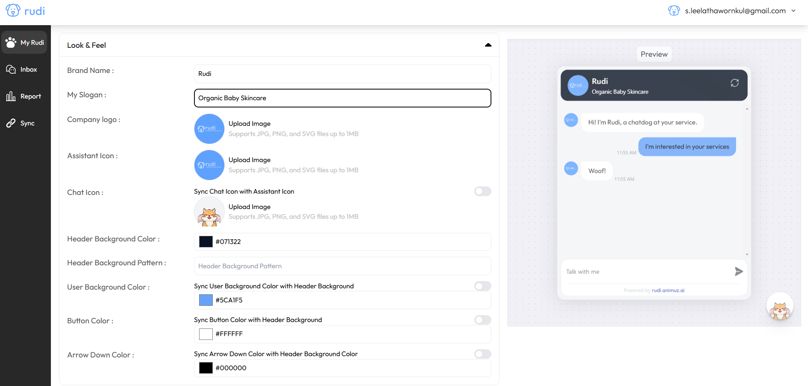
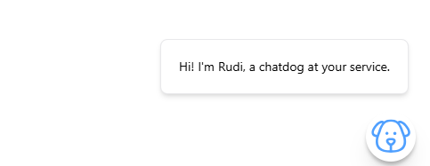

# Template Rudi 🗎 
:::info[การตั้งค่า CI Chatbot]

สามารถแจ้งทีมงาน Rudi ได้เลย พวกเรามีทีมงาน IT สนับสนุนค้าบ🐶

:::

## วิธีการตั้งค่า CI Chatbot AI
### อ้างอิงจาก Step 3 การ Design  

1. Brand Name : ชื่อแบรนด์
2. My Slogan : สโลแกนของแบรนด์ 
3. Company logo : โลโก้บริษัทด้านบนสุด 
4. Assistant Icon : รูปภาพของ Chatot
5. Chat Icon : รูปภาพ/โลโก้มุมขวาล่าง 
6. Setup Color 
    6.1 Header Background Color : สีพื้นหลังของหัวเรื่อง
    6.2 Header Text Color : สีพื้นหลังของปุ่มกดแชท
    6.3 User Background Color : สีพื้นหลังของลูกค้า/ผู้ใช้งาน

### การตั้งค่า Greeting

 

แนะนำ 2 ประโยค ประโยคละไม่เกิน ปป

