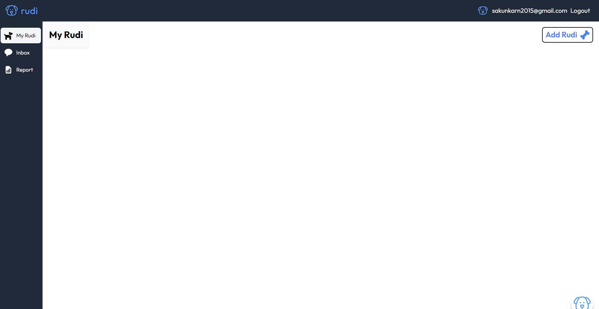
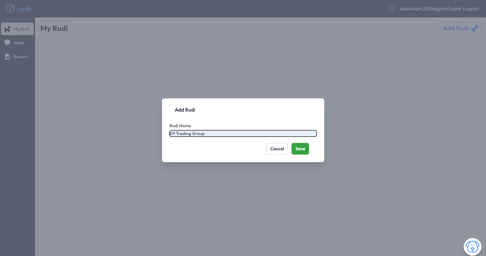
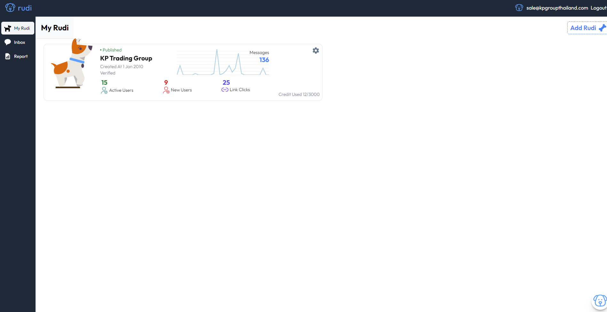
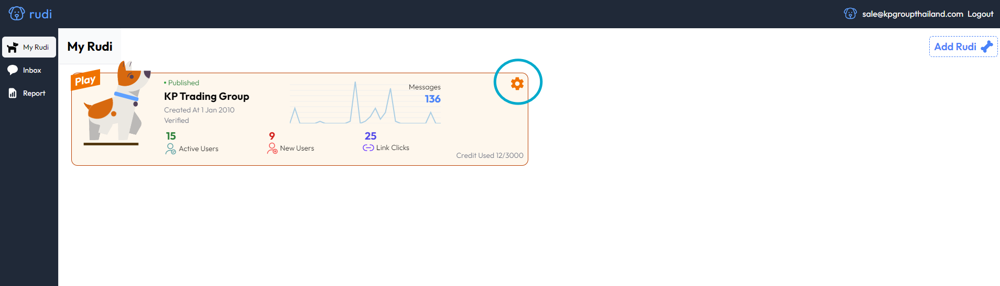
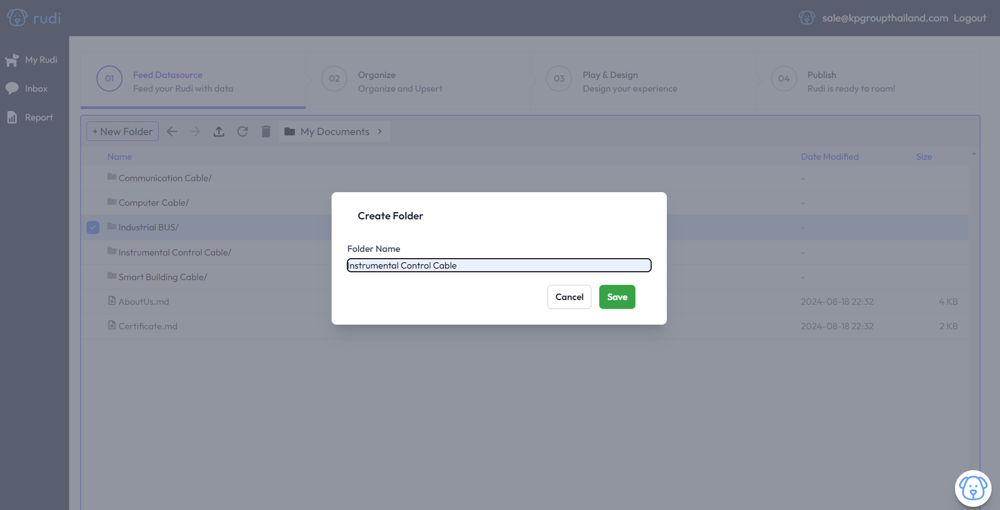
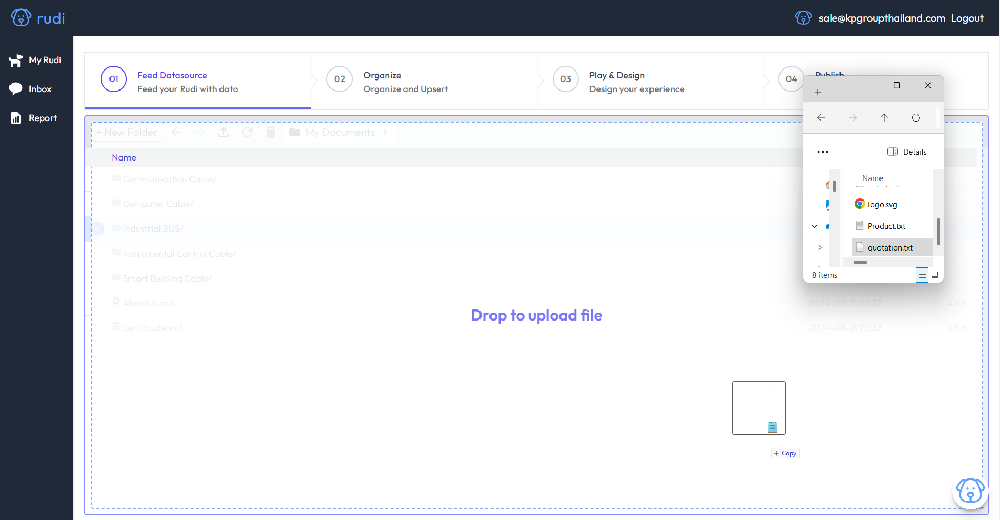
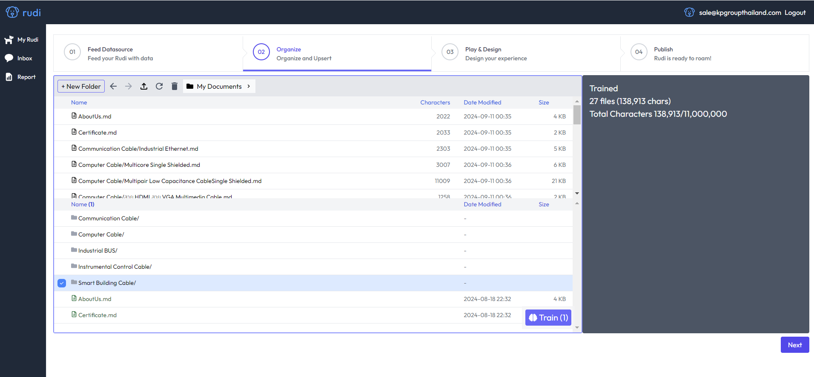
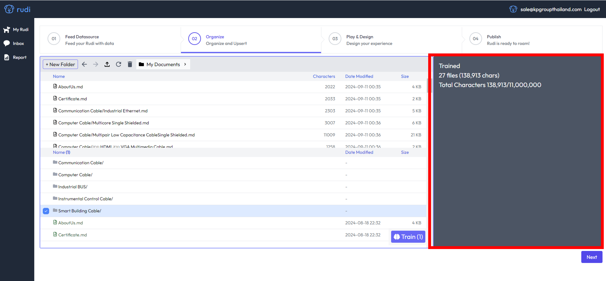
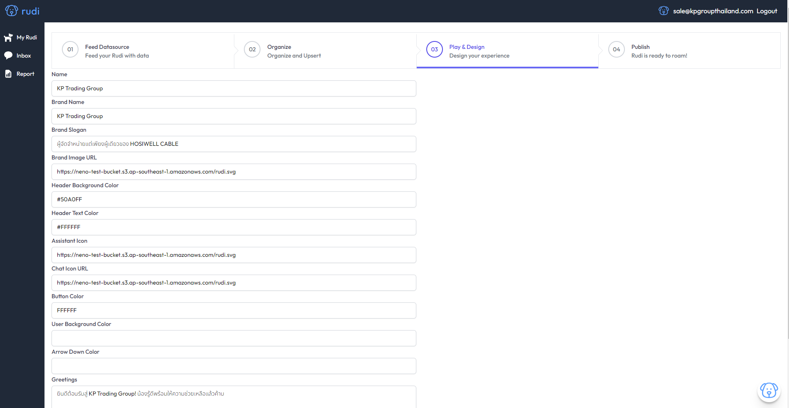

# Create a Rudi 🐕

## ขั้นตอนการสร้าง Rudi 
### คลิก "Add Rudi" 
 

### ตั้งชื่อ "Rudi"

### คุณจะได้น้อง Rudi หมาน้อยพร้อมเป็นเพื่อนในการทำงาน

## มาเริ่มฝึกเจ้าน้อง Rudi กันเลย 
คลิกที่ การตั้งค่า

### Step 1. ขั้นตอนการป้อนข้อมูลให้ Rudi (Import Data)
#### คลิก "Feed Datasource"
- ถ้าต้องการจัดกลุ่มข้อมูล คลิกสร้าง Floder
- ตั้งชื่อ Floder (ถ้ามมี)

- ลากไฟล์ข้อมูลลงใน ระบบ หรือ Floder ที่ส้ราง

- กดปุ่ม Next สำหรับต้องการ Train ข้อมูล

### Step 2. ขั้นตอนการฝึกน้อง Rudi (Train Rudi)
#### คลิก "Organize and Upsert" 
- คลิกเลือกไฟล์ที่ต้องการ Train 
- กดปุ่ม train 

:::tip["Success"]

ฝึกสำเร็จ

:::

:::danger["Error"]

ฝึกข้อมูลไม่ผ่าน

:::

- ขวามือ แสดงจำนวนไฟล์ทั้งหมดและจำนวนตัวอักษณที่ถูก Train

### Step 3. ขั้นตอนการ Design Chatbot
#### คลิก Play & Design 
- Setup ChatUI ตามที่หัวข้อระบุ  
- Greetings =  คำทักทายก่อนเริ่มบทสนทนา 
- กดปุ่ม "Save"

:::info[สำหรับการตั้งค่าครั้งแรก]

สามารถแจ้งทีมงาน Rudi ได้เลย พวกเรามีทีมงาน IT สนับสนุนค้าบ🐶

:::

### Step 4. ขั้นตอนการ Publish
- กดปุ่ม Pubslih
- กด Copy Code
- นำ Code ที่ได้ไปติดตั้งไว้ใน Web ของตนเอง

:::info[สำหรับการตั้งค่าครั้งแรก]

สามารถแจ้งทีมงาน Rudi ได้เลย พวกเรามีทีมงาน IT สนับสนุนค้าบ🐶

:::

## คลิปวิดีโอ สำหรับการทำงานทั้งหมด
<iframe width="560" height="315" src="https://www.youtube.com/embed/rlijAuVf9Fc?si=fyzJSHm3TzRNnRvO" title="YouTube video player" frameborder="0" allow="accelerometer; autoplay; clipboard-write; encrypted-media; gyroscope; picture-in-picture; web-share" referrerpolicy="strict-origin-when-cross-origin" allowfullscreen></iframe>