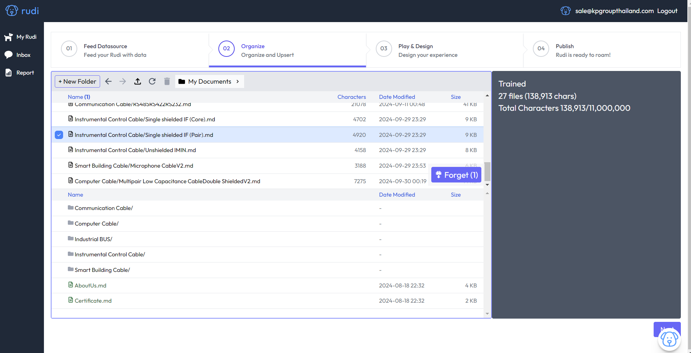
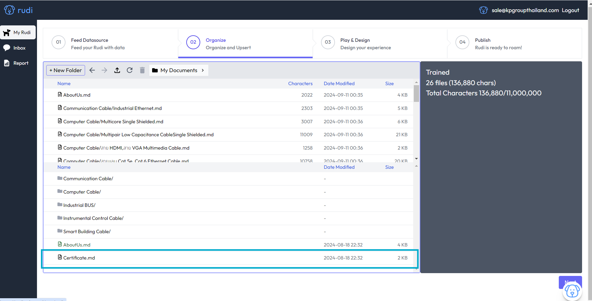

# Create Data Source 🌭

:::danger["Note"]

สำหรับการสร้างเนื้อหาที่ต้องการแนบลิงก์ URL

:::

### แบบที่ 1.การสร้างเนื้อหาด้วยไฟล์ .txt

<!--  // Image -->

1. สร้างไฟล์ คลิกขวาเลือกไฟล์ที่ชื่อว่า "Text Document"
2. ทำจัดเรียงข้อมูล ดูรายละเอียดามวิดีโอ
   - สัญญาลักษณ์ "#" = H1 หัวข้อหลัก
   - สัญญาลักษณ์ "##" = H2 หัวข้อย่อย

<iframe width="560" height="315" src="https://www.youtube.com/embed/rj_S2ZxB2_Y?si=khdGH7P0PptvzXpE" title="YouTube video player" frameborder="0" allow="accelerometer; autoplay; clipboard-write; encrypted-media; gyroscope; picture-in-picture; web-share" referrerpolicy="strict-origin-when-cross-origin" allowfullscreen></iframe>

### แบบที่ 2.การสร้างเนื้อหาด้วยไฟล์ .md

1. สร้างไฟล์ คลิกขวาเลือกไฟล์ที่ชื่อว่า "Text Document" และเปลี่ยนนามสกลุเป็น ".md"
2. ทำจัดเรียงข้อมูล ดูรายละเอียดามวิดีโอ
   - สัญญาลักษณ์ "#" = H1 หัวข้อหลัก
   - สัญญาลักษณ์ "##" = H2 หัวข้อย่อย

:::info[สำหรับ "โปรแกรม visual studio"]

<iframe width="560" height="315" src="https://www.youtube.com/embed/ZP6lWgiMCvo?si=MQQlb5LGOn5N2c4l" title="YouTube video player" frameborder="0" allow="accelerometer; autoplay; clipboard-write; encrypted-media; gyroscope; picture-in-picture; web-share" referrerpolicy="strict-origin-when-cross-origin" allowfullscreen></iframe>
:::

## คู่มือการทำ Data Source 📘

นามสกุลไฟล์ที่แนะนำเป็น .md [Markdown]

การเขียนส่วนหัว ( Header ) - สัญญาลักษณ์ "#" = H1 หัวข้อหลัก - สัญญาลักษณ์ "##" = H2 หัวข้อรอง - สัญญาลักษณ์ "###" = H3 หัวข้อย่อย

#### การเขียนรายการ/เรียงลำดับ ( Ordered Lists )

    1. ขั้นตอนที่ 1
       1. รายละเอียดภายในขั้นตอนที่ 1
       2. รายละเอียดภายในขั้นตอนที่ 1
    2. ขั้นตอนที่ 2

#### การใส่ลิงค์ ( Links )

`[ข้อความ](URL)`

#### การใส่รูปภาพ ( Images )

``

#### ตัวอย่างการเขียนจริง

[ดาวน์โหลดไฟล์ตัวอย่าง](../static/write_data_source.txt)

:::info[วิดีโอสาธิตการเขียนข้อมูลจริง]

<iframe width="560" height="315" src="https://www.youtube.com/embed/9rtUNqejWEk" title="YouTube video player" frameborder="0" allow="accelerometer; autoplay; clipboard-write; encrypted-media; gyroscope; picture-in-picture; web-share" referrerpolicy="strict-origin-when-cross-origin" allowfullscreen></iframe>
:::

## ป้อนอาหาร Rudi 🍗

:::info["Note"]

สำหรับอัปโหลดเนื้อหาให้ Rudi หรือเพิ่มความฉลาดของ Rudi

:::

#### 1. ลากไฟล์ข้อมูลลงใน ระบบ หรือ Floder ที่ส้ราง

#### 2. คลิกเลือกไฟล์ที่ต้องการ Train

- กดปุ่ม train
  

#### 3. ยกเลิกข้อมูลที่ Train

- คลิกเลือกไฟล์ที่ต้อง "ยกเลิก" การ Train ข้อมูล
- คลิก "Forget"
  

:::tip["Success"]

สำเร็จไฟล์นั้น จะเป็นสีดำ

:::

