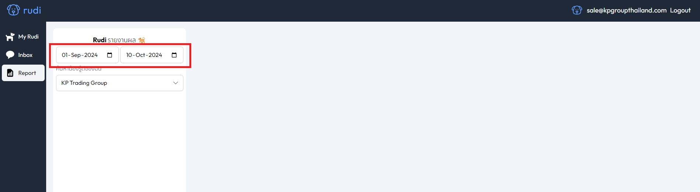
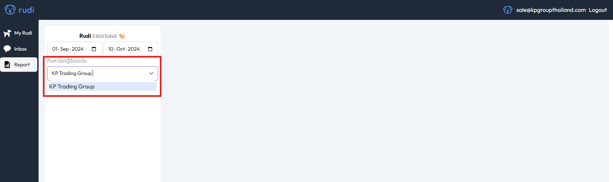
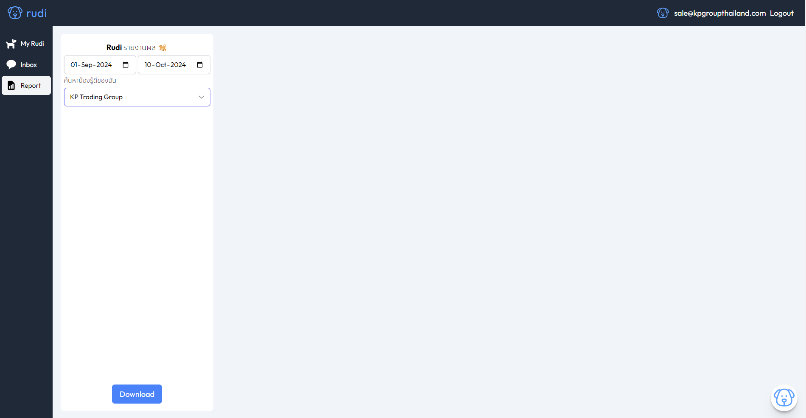
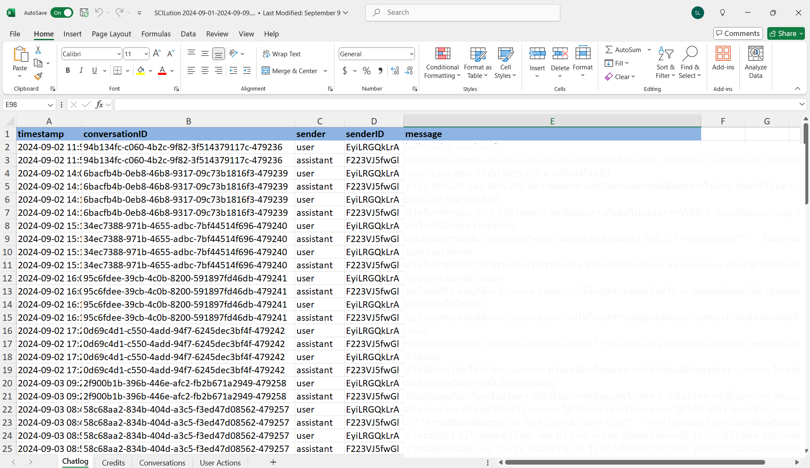

# Download Report 🐶🗎

ดาวน์โหลด **รายงานสรุป** การทำงานของ Rudi ในช่วงเวลาที่เลือก เพื่อนำไปวิเคราะห์ต่อหรือแชร์ให้ทีมได้สะดวก 📊

## ขั้นตอนการดาวน์โหลดรายงาน 📥
### คลิกเมนู "Report" 🗂️
#### Step 1. เลือกวันที่เริ่มต้น - วันที่สิ้นสุด 📅

#### Step 2. เลือกน้อง Rudi ที่ต้องการดู (หากมีน้อง Rudi หลายตัว) 🐕

#### Step 3. คลิก "Download" ⬇️

:::info[ดาวน์โหลดเรียบร้อย]

ไฟล์ที่ได้รับจะเป็น "Excel" ในไฟล์ประกอบด้วย 4 รูปแบบ

:::

### ตัวอย่าง รายงาน 📄

