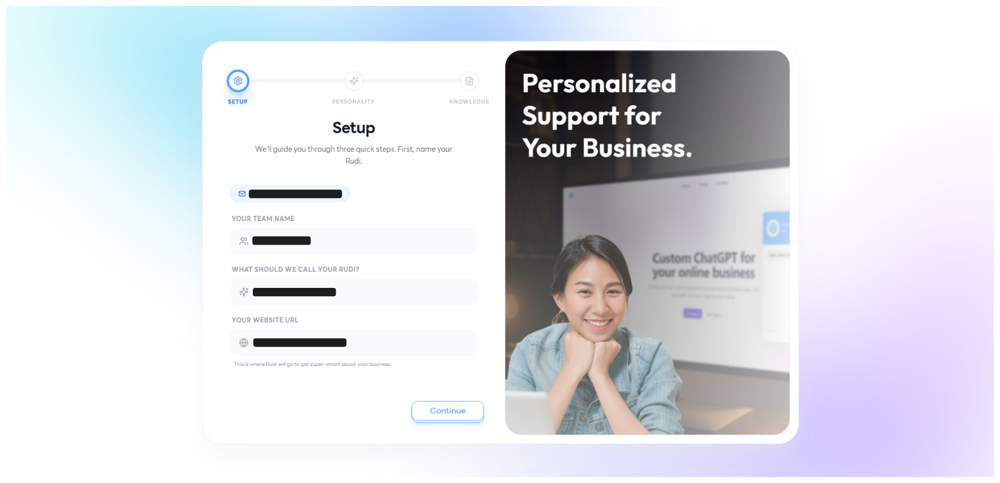
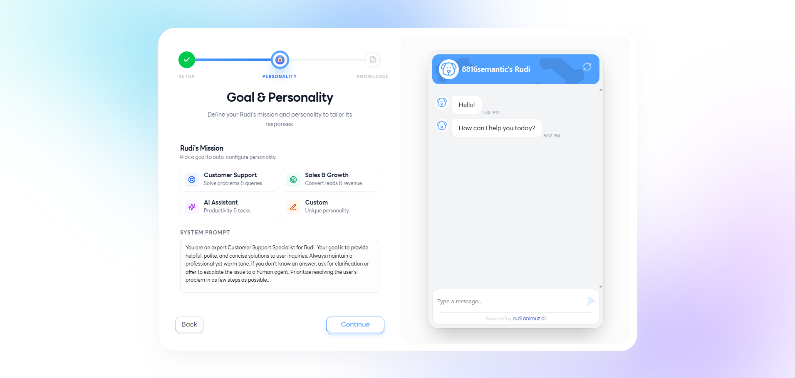
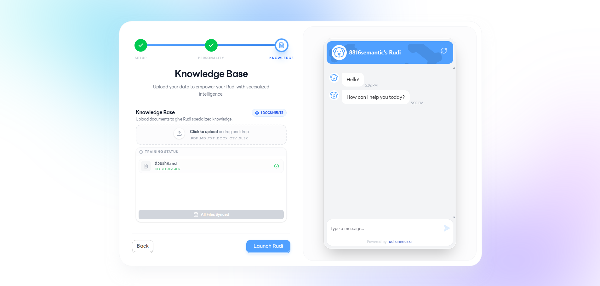
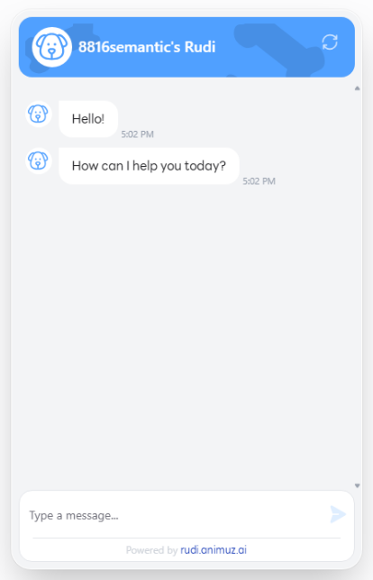

# Onboarding 👋

ขั้นตอนการตั้งค่าเริ่มต้นเพื่อปลุกน้อง **Rudi** ให้พร้อมทำงานกับทีมของคุณ ใช้เวลาเพียงไม่กี่นาที ก็พร้อมเริ่มใช้งานได้ทันที 🚀

---

## Step 1: Setup ⚙️

ขั้นตอนแรกสำหรับการตั้งค่าข้อมูลพื้นฐานของทีมและ Rudi เพื่อให้ระบบรู้จักธุรกิจของคุณ

- **Your Team name** 🏢 — ชื่อทีมหรือชื่อแบรนด์ของคุณ ใช้แสดงในระบบและการสื่อสารกับลูกค้า
- **What should we call your Rudi?** 🐕 — ตั้งชื่อให้น้อง Rudi ของคุณ ชื่อนี้จะเป็นชื่อที่ลูกค้าเห็นเวลาคุยกับ AI
- **Your website URL** 🌐 — ลิงก์เว็บไซต์หลักของธุรกิจ ระบบจะนำไปใช้เป็นข้อมูลอ้างอิงเริ่มต้นของ Rudi

---

## Step 2: Goal & Personality 🎯

กำหนดเป้าหมายและบุคลิกของ Rudi เพื่อให้ตอบลูกค้าได้ตรงกับสไตล์ธุรกิจของคุณ

### Rudi's Mission 🚀

เลือกภารกิจหลักของ Rudi ว่าต้องการให้ช่วยงานด้านใดเป็นหลัก

- **Customer Support** 💬 — ตอบคำถามและช่วยเหลือลูกค้าเรื่องการใช้งานสินค้า/บริการ
- **Sales & Growth** 💰 — ช่วยปิดการขาย แนะนำสินค้า และกระตุ้นการตัดสินใจซื้อ
- **AI Assistant** 🤖 — ผู้ช่วยอเนกประสงค์ ตอบได้ทั้งงานทั่วไปและให้ข้อมูลรอบด้าน
- **Custom** ✨ — กำหนดบทบาทเองตามรูปแบบเฉพาะของธุรกิจคุณ

### System Prompt 📝

คำสั่งหลัก (Prompt) ที่ใช้กำหนดบุคลิก น้ำเสียง และแนวทางการตอบของ Rudi เช่น สุภาพ เป็นกันเอง หรือเป็นทางการ — ยิ่งระบุชัด Rudi ก็จะตอบได้ตรงใจมากขึ้น

---

## Step 3: Knowledge Base 📚

อัปโหลดข้อมูลความรู้ของธุรกิจให้ Rudi เรียนรู้ เพื่อให้ตอบคำถามลูกค้าได้อย่างแม่นยำ

- **Upload documents for sync** 📤 — รองรับไฟล์หลากหลายรูปแบบ ได้แก่ `pdf`, `md`, `txt`, `docx`, `csv`, `xlsx`
- ยิ่งให้ข้อมูลครบถ้วนเท่าไร Rudi ก็จะยิ่งฉลาดและตอบได้ตรงกับธุรกิจของคุณมากขึ้น 🧠

---

## Playground 🧪

พื้นที่สำหรับทดสอบพูดคุยกับ Rudi ก่อนใช้งานจริง ใช้ตรวจสอบว่า Rudi เข้าใจข้อมูลที่ให้ไป และตอบได้ถูกต้องตามที่คาดหวัง — หากยังไม่ตรงใจ สามารถกลับไปปรับแต่งในขั้นตอนก่อนหน้าได้ทันที 💡

