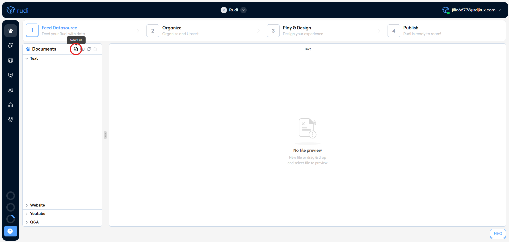
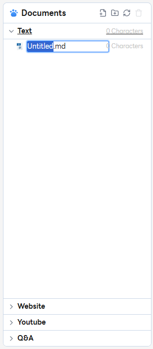
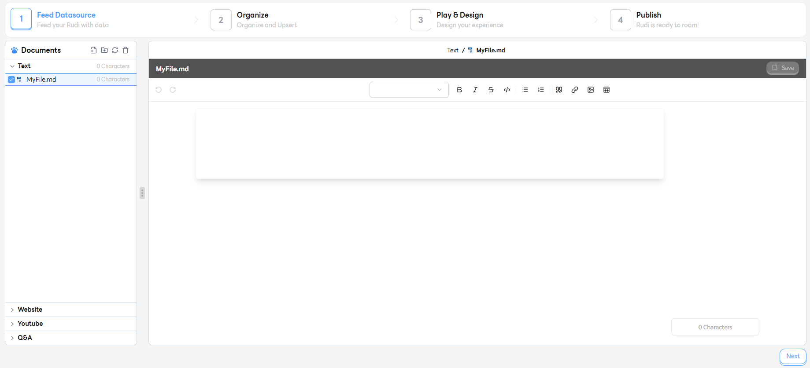
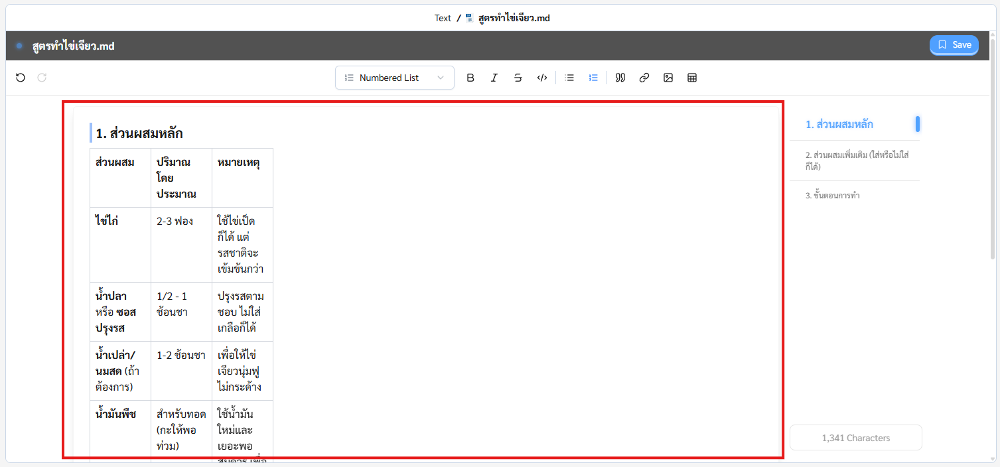
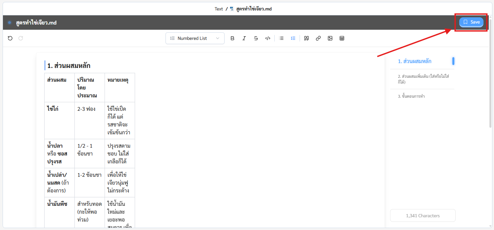
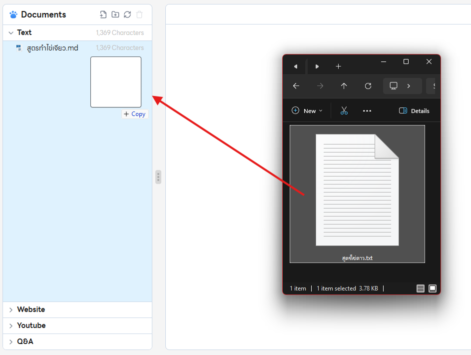
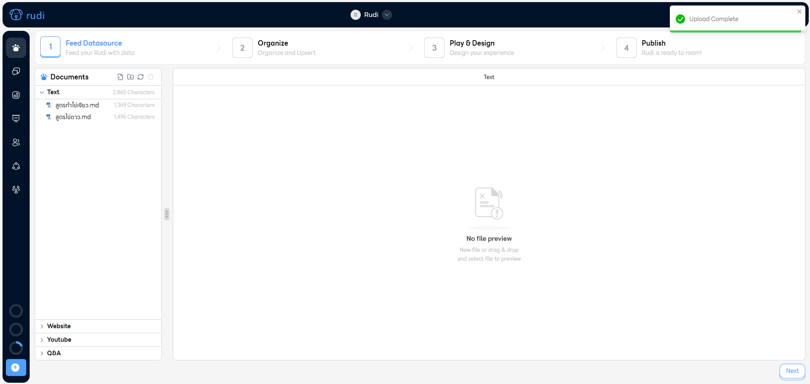
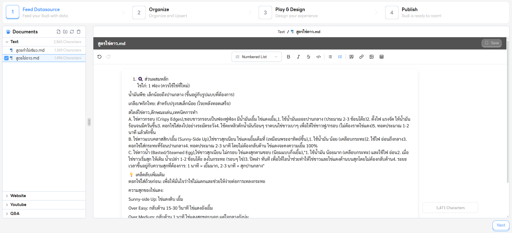

# Step 1: Feed Datasource 📥

เพิ่ม **ไฟล์ข้อมูล** ไว้ให้น้อง Rudi ฝึกกันเถอะ! 🐶
มี **2 วิธี** ด้วยกัน

## 1. เพิ่มไฟล์ด้วยแท็ปเครื่องมือ 🛠️

### 1.1 คลิกไอคอนเพิ่มไฟล์

### 1.2 ตั้งชื่อไฟล์ `Default: Untitled.md`

### 1.3 แสดงหน้าต่างแก้ไขข้อความ

### 1.4 เพิ่มหรือแก้ไขข้อมูลภายในหน้าต่างแก้ไขข้อความได้ตามต้องการ

[วิธีการใช้งานหน้าต่างแก้ไขข้อความ](step1/text-editor)

### 1.5 คลิก `Save` หรือ `Ctrl + S | Cmd + S` เพื่อบันทึกไฟล์

---

## 2. เพิ่มไฟล์จากภายในเครื่อง 💻

### 2.1 ลากไฟล์ลงในแถบนำทางไฟล์ (File Explorer)

2.2 ระบบจะทำการประมวลผลไฟล์และบันทึกอัตโนมัติ

### 2.3 สามารถเพิ่มหรือแก้ไขข้อมูลภายในหน้าต่างแก้ไขข้อความได้ตามต้องการ

[วิธีการใช้งานหน้าต่างแก้ไขข้อความ](step1/text-editor)

---

## เพิ่มข้อมูลเสร็จแล้ว คลิก `Next` และนำข้อมูลไปให้น้อง Rudi ฝึกกัน! 🐶
