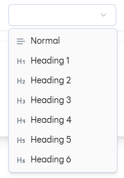
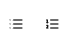
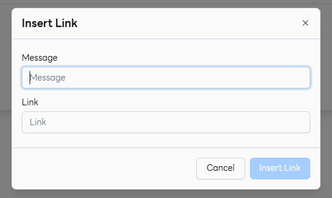
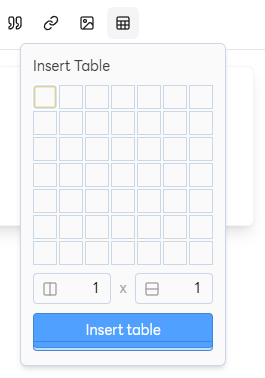

# Text Editor Usage

**Text Editor (หน้าต่างแก้ไขข้อความ)**

นี่คือรายการฟังก์ชันและเครื่องมือหลักทั้งหมดที่ใช้ในการจัดการและจัดรูปแบบข้อความ โดยจัดทำในรูปแบบรายการเพื่อให้ง่ายต่อการอ่าน:

## 1. การจัดโครงสร้าง (Text Structure)

- **Heading 1-6:** กำหนดระดับความสำคัญของหัวข้อหลักและหัวข้อรอง
- **Paragraph:** กำหนดข้อความเป็นย่อหน้าปกติสำหรับเนื้อหาทั่วไป

## 2. รูปแบบข้อความ (Text Style)

- **Bold:** เน้นข้อความให้เป็นตัวหนา
- **Italic:** เน้นข้อความให้เป็นตัวเอียง
- **Strikethrough:** ขีดฆ่าข้อความ
- **Code:** ใช้แสดงตัวอย่างโค้ดสั้น ๆ หรือข้อความในรูปแบบเฉพาะ
- **Blockquote:** ใช้สำหรับข้อความอ้างอิง หรือข้อความที่ต้องการเน้นแยกออกมา

## 3. การจัดการรายการ (List)

- **Numbered List:** สร้างรายการที่มีลำดับขั้นตอน (เช่น 1., 2., 3.)
- **Bulleted List:** สร้างรายการแบบมีสัญลักษณ์ (เช่น •, -)

## 4. เนื้อหาพิเศษและการแทรก (Special Content & Insertion)

- **Insert Link:** สร้าง Hyperlink เพื่อเชื่อมโยงไปยังแหล่งข้อมูลภายนอก (URL)
- **Insert Table:** สร้างตารางเพื่อจัดเรียงข้อมูลเป็นแถวและคอลัมน์

### 4.1 Insert Link

### 4.2 Insert Table

## 5. การจัดการการแก้ไข (Edit Management)

- **Undo:** ย้อนกลับการกระทำล่าสุด
- **Redo:** ทำซ้ำการกระทำที่เพิ่งยกเลิกไป
