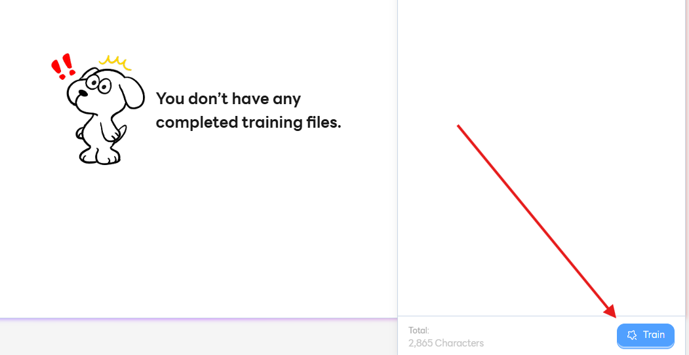
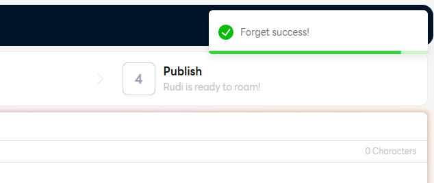

# Step 2: Organize

Rudi ต้องการข้อมูลมาฝึกฝน 🐶

## ขั้นตอนการ Train ไฟล์ 🏃

เริ่มต้นที่ Step 2 กันเลย

### 1. เลือกไฟล์ที่ต้องการ Train ในแถบนำทางไฟล์ (File Explorer)

### 2. คลิก `Train`

### 3. กำลังประมวลผลไฟล์ที่ Train อยู่นะครับ ⌛

:::tip["Success"]

ฝึกสำเร็จ

:::

:::danger["Error"]

ฝึกข้อมูลไม่ผ่าน

:::

### 4. ไฟล์ที่ได้รับการ Train แล้วจะแสดงเป็นตัวอักษรสีเขียวแบบนี้เลย 🟢

---

:::info[ต้องการยกเลิกไฟล์ที่ Train ไว้?]
ทำตาม Rudi ได้เลย ดังนี้
:::

## ยกเลิกข้อมูลที่ Train ❌

### 1. เลือกไฟล์ที่ Train ในแท็ป Train file

### 2. คลิก `Forgot data`

### 3. Train ไฟล์เสร็จสิ้น

:::tip["Success"]

Forget ข้อมูลสำเร็จ

:::

:::danger["Error"]

Forget ข้อมูลไม่ผ่าน

:::

---

## ไป Step 3 เพื่อเพิ่มประสิทธิภาพให้กับเจ้า Rudi! 🐶
