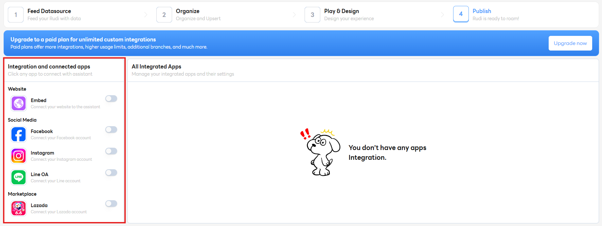

# Step 4: Publish

ขั้นตอนการ Publish

## เพิ่มการเชื่อมต่อ

- **[Website Embed](../../docs/sync/embed)** - เป็นการนำโค้ด (Embed Code) ไปติดตั้งบน **เว็บไซต์** ของคุณ ทำให้แชทบอทปรากฏเป็น **วิดเจ็ต (Widget)** หรือ **ไอคอนแชทลอย** อยู่ที่มุมใดมุมหนึ่งของหน้าเว็บไซต์ ลูกค้าสามารถคลิกเพื่อสนทนาได้ทันที
- **[LINE Official Account](../../docs/sync/line)** - เป็นการเชื่อมต่อแชทบอทเข้ากับบัญชี **LINE Official Account** ของคุณ ทำให้แชทบอททำหน้าที่ **ตอบข้อความอัตโนมัติ** แทนแอดมินในแอปพลิเคชัน LINE ซึ่งเป็นที่นิยมในประเทศไทย
- **[Facebook Page](../../docs/sync/facebook)** - เป็นการเชื่อมต่อแชทบอทเข้ากับกล่องข้อความ **Messenger** ของ **Facebook Page** ธุรกิจของคุณ แชทบอทจะตอบโต้กับผู้ใช้ที่ส่งข้อความมายังเพจนั้น
- **[Lazada](../../docs/sync/lazada)** - ในบริบทของอีคอมเมิร์ซ มักหมายถึงการผสานรวมแชทบอทเข้ากับระบบ **Chat** ของร้านค้าบนแพลตฟอร์ม **Lazada** เพื่อช่วยตอบคำถามเกี่ยวกับสินค้า คำสั่งซื้อ หรือการจัดส่ง
  <!-- - **[Instagram](../../docs/sync/instagram)** - เป็นการเชื่อมต่อแชทบอทเข้ากับข้อความ **Direct Message (DM)** ของบัญชี **Instagram** ธุรกิจของคุณ -->
