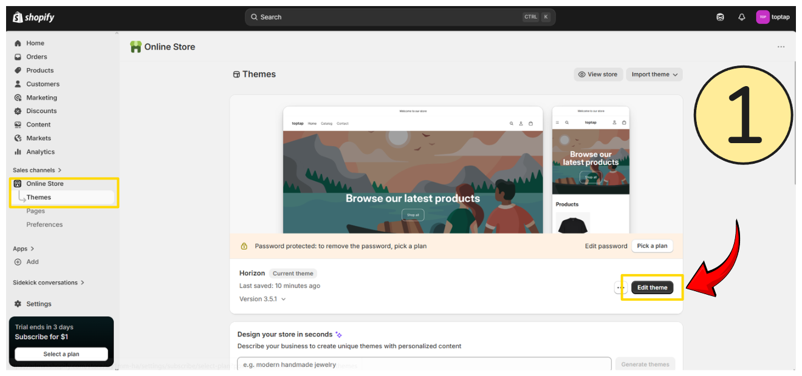
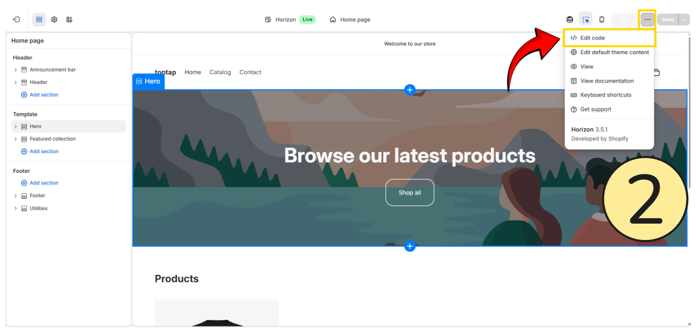
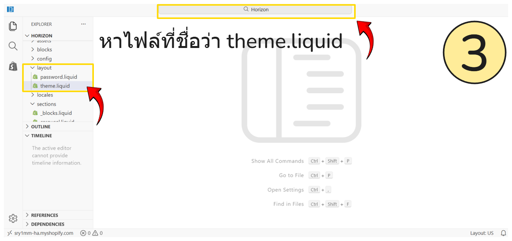
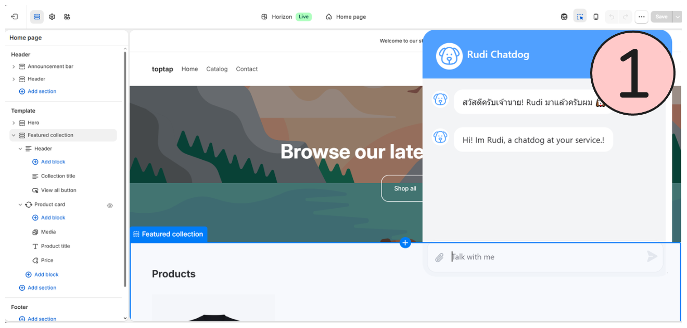
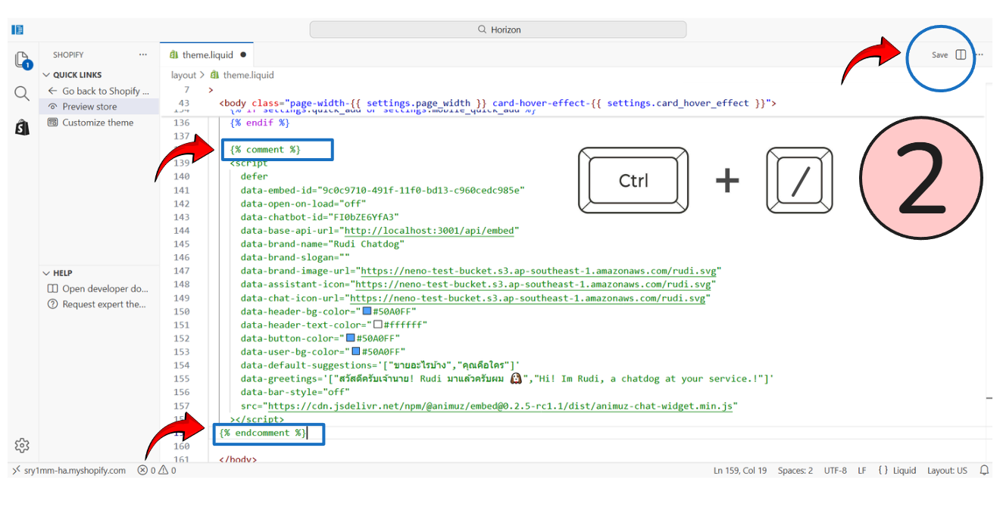
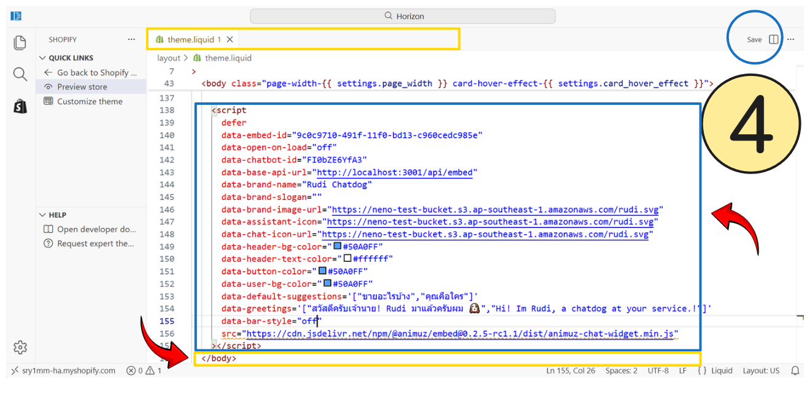

# How to embed on Shopify 🛍️

ติดตั้ง **Rudi Chat Embed** ในร้านค้า **Shopify** ของคุณ เพื่อช่วยตอบลูกค้าและปิดการขายได้อัตโนมัติ 💬

### วิธีการติดตั้ง Rudi Chat Embed ในร้านค้าของ Shopify 🟡

1. ไปที่เมนู **Online Store > Themes** และหาปุ่ม **Edit theme**

---

2. เมื่อเข้ามาในหน้า Edit theme แล้ว ให้มองไปที่แถบด้านบน ". . ." และกด **Edit code**

---

3. ทำการหาไฟล์ที่มีชื่อว่า **theme.liquid** หาได้ 2 วิธี

    3.1 แถบด้านซ้าย **layout > theme.liquid**

    3.2 ค้นหาจากช่องด้านบน

---

4. เมื่อเปิดไฟล์ **theme.liquid** แล้ว ให้เลื่อนลงมีที่ล่างสุด :point_right: ทำการวาง script ให้อยู่เหนือ tag `</body>`, แล้วทำการกด **Save** ในกรอบ วงกลมสีฟ้า

---

5. เมื่อทำการ Preview หน้าร้านค้าของเรา จะเห็นว่า Rudi Chat Embed มาแล้วเป็นที่เรียบร้อย

:::info["เสริม"]
หากว่าหลังจากนี้ ร้านค้า จะต้องทำการเข้ามาแก้ไขเนื้อหาใดๆ จะพบกับ Rudi Chat Embed แสดงขึ้นมาเสมอ (หากไม่อยากพบเจอ) จะต้องทำการ ปิด Tag ชั่วคราวก่อน

จะเห็นตามภาพว่า Rudi Chat Embed แสดงขึ้นมาเสมอ ให้ทำการ ให้มองไปที่แถบด้านบน ". . ." และกด **Edit code**
ทำการใส่ Tag ปิด code script ชั่วคราวก่อน (ตามภาพ) หรือทำการเอาเมาส์คลุม code script ทั้งหมดและกด ( `ctrl` + `/` ) ระบบจะ ปิดให้อัตโนมัติ
และทำการ กด **Save**
:::
