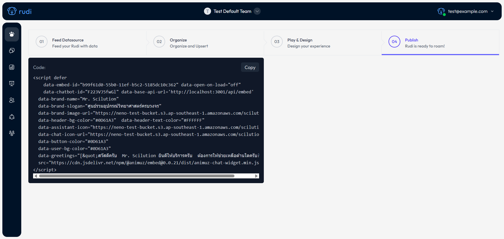

# How to embed on Wix

### เพิ่ม Rudi เข้าไปในเว็บไซต์

:::info
ก่อนเริ่มต้นการฝังโค้ด (Embed) กรุณาตรวจสอบว่าเว็บไซต์ของคุณได้เผยแพร่เรียบร้อยแล้ว และเชื่อมต่อกับโดเมนอย่างถูกต้อง
:::

- เลือกเว็บไซต์ที่คุณต้องการฝัง Rudi

- ไปที่เมนู Setting และเลือก Customize code

- คลิกที่ Add Custom Code

- คัดลอกโค้ดสำหรับการฝังโค้ดจาก [Rudi Website](https://app.rudi.animuz.ai/app/rudi)

- วางโค้ดลงในช่องสำหรับฝังโค้ด จากนั้นตั้งชื่อโค้ดเพื่อให้จดจำได้ง่าย และคลิก Apply เพื่อยืนยันการฝัง Rudi

