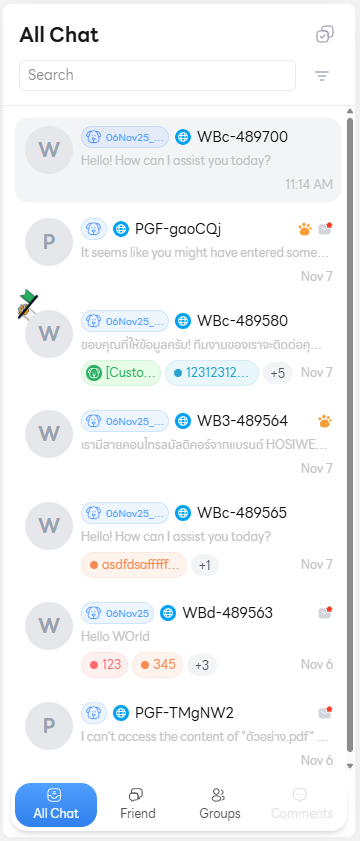

# Chat List 🖥️

**Chat List (รายการแชท)** คือหน้าหลักที่แสดงรายการบทสนทนาทั้งหมดที่ผู้ใช้งาน (เจ้าหน้าที่ หรือ ผู้ใช้) มีอยู่ โดยเป็นเครื่องมือหลักในการจัดระเบียบและเข้าถึงการสนทนาอย่างรวดเร็ว

## 1. การค้นหาและฟิลเตอร์ (Search and Filters)

เป็นเครื่องมือที่ช่วยให้ผู้ใช้ **ค้นหาและจำกัด** ขอบเขตของรายการแชทขนาดใหญ่ให้แคบลงอย่างรวดเร็ว

## 2. การจัดการแชท (Chat Management)

ฟังก์ชันการจัดการที่ช่วยให้ผู้ใช้สามารถดำเนินการกับแชทแต่ละรายการได้โดยตรงจาก List

## 3. สถานะ/รายละเอียด (Status/Details per Item)

ข้อมูลที่ปรากฏอยู่ข้างๆ ชื่อของแต่ละบทสนทนาในรายการแชท เพื่อให้ข้อมูลสรุปอย่างรวดเร็ว

## 4. แถบนำทางหลัก (Main Navigation Tabs)

แถบนี้ใช้เพื่อ **แบ่งกลุ่มและกรอง** รายการแชทตามประเภทของการสนทนา

- **All Chat:** แสดง บทสนทนาทั้งหมด ที่ผู้ใช้เกี่ยวข้อง ไม่ว่าจะเป็นแชทส่วนตัว, กลุ่ม, หรือคอมเมนต์ ถือเป็นมุมมองเริ่มต้นและครอบคลุมที่สุด
- **Friend (แชทแบบตัวต่อตัว):** แสดงรายการแชทแบบ ตัวต่อตัว (Direct Message) หรือการสนทนาส่วนตัว (Private Chat)
- **Groups (แชทกลุ่ม):** แสดงรายการแชทที่เกิดขึ้นใน ห้องสนทนากลุ่ม ซึ่งมีผู้เข้าร่วมตั้งแต่สามคนขึ้นไป
<!-- - **Comments:** `Coming soon…` -->
