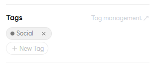
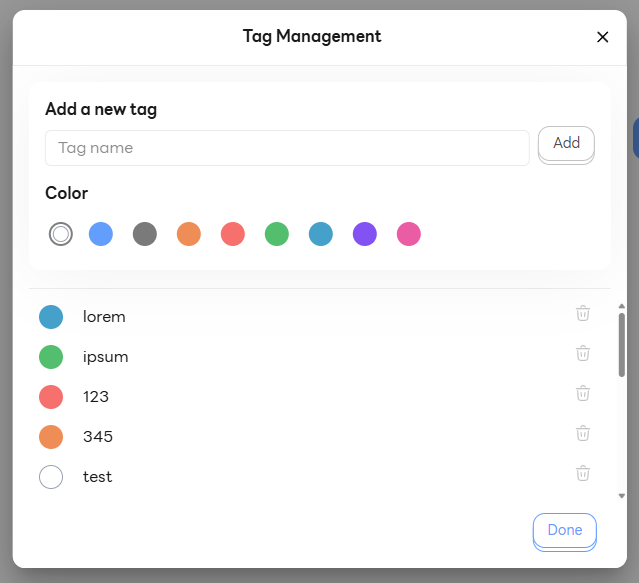
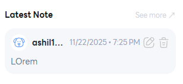

# Contact Details Panel 👤

**Contact Details Panel (รายการแชท)**

---

## 1. รายละเอียดการติดต่อ (Contact Detail)

### 1.1 ชื่อ (Name)

- แสดงชื่อที่ใช้แสดงผล (Display Name) ของลูกค้าหรือผู้ติดต่อ
- สามารถกดแก้ไขชื่อได้เพื่อให้ง่ายต่อการระบุตัวตนหรือค้นหาในภายหลัง

### 1.2 เบอร์โทร (Phone number)

- แสดงหมายเลขโทรศัพท์หลักสำหรับใช้ติดต่อสื่อสารกับลูกค้า

### 1.3 อีเมล (Email)

- แสดงที่อยู่อีเมลของลูกค้าสำหรับใช้ส่งข้อมูล ข่าวสาร หรือเอกสารสำคัญ

---

## 2. การจัดการแท็ก (Tag Management)

### 2.1 เพิ่มแท็กใหม่ (Add new tag)

- ติดป้ายกำกับเพื่อจัดหมวดหมู่ลูกค้า (เช่น VIP, ลูกค้าใหม่, รอติดตามผล)
- ช่วยให้เจ้าหน้าที่สามารถค้นหาหรือคัดกรองกลุ่มลูกค้าได้สะดวกรวดเร็วขึ้น

### 2.2 ลบแท็ก (Remove tag)

- กดเครื่องหมายกากบาท (x) บนแท็กเพื่อลบป้ายกำกับที่ไม่ต้องการออก
- ช่วยคัดกรองข้อมูลลูกค้าให้เป็นปัจจุบันและไม่ซับซ้อนจนเกินไป

### 2.3 การจัดการแท็ก (Tag Management)

- หน้าต่างสำหรับจัดการรายการแท็กทั้งหมดที่มีในระบบ (สร้างใหม่ หรือ แก้ไขชื่อแท็ก)
- ช่วยควบคุมมาตรฐานการใช้ชื่อแท็กให้เป็นระเบียบเดียวกันทั้งทีม

---

## 3. โน๊ตล่าสุด (Latest Note)

- แสดงข้อความบันทึกล่าสุดที่เจ้าหน้าที่ระบุไว้ เพื่อให้เห็นสถานะปัจจุบันได้ทันที
- ช่วยลดเวลาในการกดเข้าไปดูประวัติทั้งหมด หากต้องการทราบเพียงความคืบหน้าล่าสุด

---

## 4. แถบนำทาง (Contact navigator)

### 4.1 รายการโน๊ตทั้งหมด (Notes)

- รวบรวมประวัติการบันทึกข้อความ (Note) ทั้งหมดของลูกค้ารายนี้ตั้งแต่อดีตจนถึงปัจจุบัน
- ช่วยให้ทีมงานสามารถติดตามเรื่องราว ปัญหา หรือความต้องการของลูกค้าได้อย่างต่อเนื่อง

### 4.2 รายการกิจกรรมทั้งหมด (Activities)

- แสดงไทม์ไลน์กิจกรรมที่เกิดขึ้นกับข้อมูลลูกค้า (System Log) เช่น การสร้างรายการ, การเปลี่ยนสถานะ
- ใช้สำหรับตรวจสอบประวัติการทำงานและการเปลี่ยนแปลงข้อมูลย้อนหลังเพื่อความโปร่งใส
