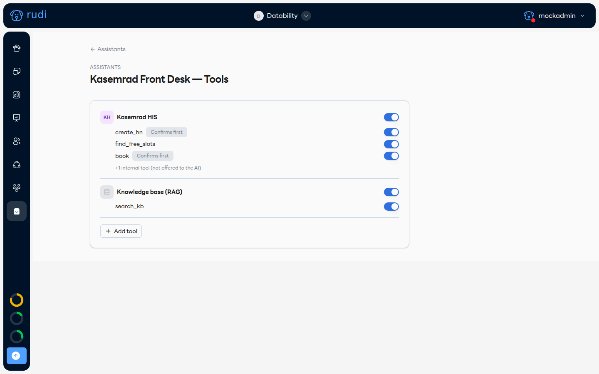

# เลือกเครื่องมือให้แต่ละผู้ช่วย 🧰

การ Add plugin ที่ [ค้นหาและเพิ่ม Plugin](./find-and-add-a-plugin.md) เป็นการเปิดใช้ให้ **ทีม** แต่แต่ละผู้ช่วย (assistant) เลือกได้เองว่าจะใช้ plugin ไหน เครื่องมือไหนบ้าง

ไปที่ผู้ช่วยตัวที่ต้องการ → แท็บ **Tools** จะเห็นรายการ plugin ที่ทีมมี พร้อมสวิตช์เปิด/ปิด:

## 1. สวิตช์ 2 ระดับ

- **สวิตช์บน (ระดับ plugin)** — เปิด/ปิดทั้ง plugin สำหรับผู้ช่วยตัวนี้
- **สวิตช์ย่อย (ระดับเครื่องมือ)** — เปิด/ปิดทีละเครื่องมือในนั้นได้ เช่น เปิด `find_free_slots` ไว้ให้ค้นคิวว่างได้ แต่ปิด `book` ถ้ายังไม่อยากให้จองคิวจริง

## 2. ป้าย Confirms first

เครื่องมือที่แก้ไขข้อมูลจริง (สร้าง HN, จองคิว, ส่งอีเมล ฯลฯ) จะมีป้าย **Confirms first** กำกับ — หมายความว่า Rudi จะเรียกเครื่องมือนี้ได้ก็ต่อเมื่อลูกค้ายืนยันรายละเอียดที่จะทำในแชทก่อนเท่านั้น ไม่มีการสั่งงานลับหลังลูกค้า

เครื่องมือที่ไม่มีป้ายนี้คือแบบอ่านอย่างเดียว (read-only) เรียกได้เลยไม่ต้องขอยืนยัน

## 3. Internal tools

บาง plugin มีเครื่องมือ "ภายใน" (เช่นเครื่องมือเช็คสถานะที่ระบบใช้เอง) — จะยุบไว้ท้ายรายการ พร้อมข้อความ "+N internal tool (not offered to the AI)" เครื่องมือกลุ่มนี้ Rudi มองไม่เห็นและเรียกเองไม่ได้ ไม่ต้องกังวลว่าจะไปยุ่งกับมัน

## 4. เพิ่มเครื่องมือใหม่

กด **+ Add tool** ท้ายรายการเพื่อเปิด plugin อื่นที่ทีมมีอยู่ให้ผู้ช่วยตัวนี้ โดยไม่ต้องไปที่ Marketplace อีกรอบ
