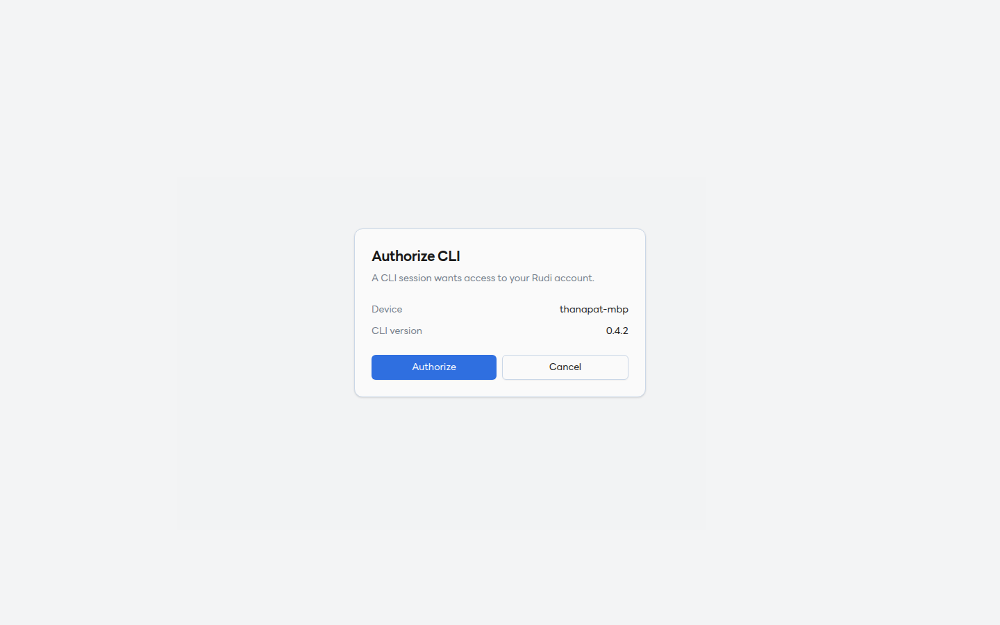
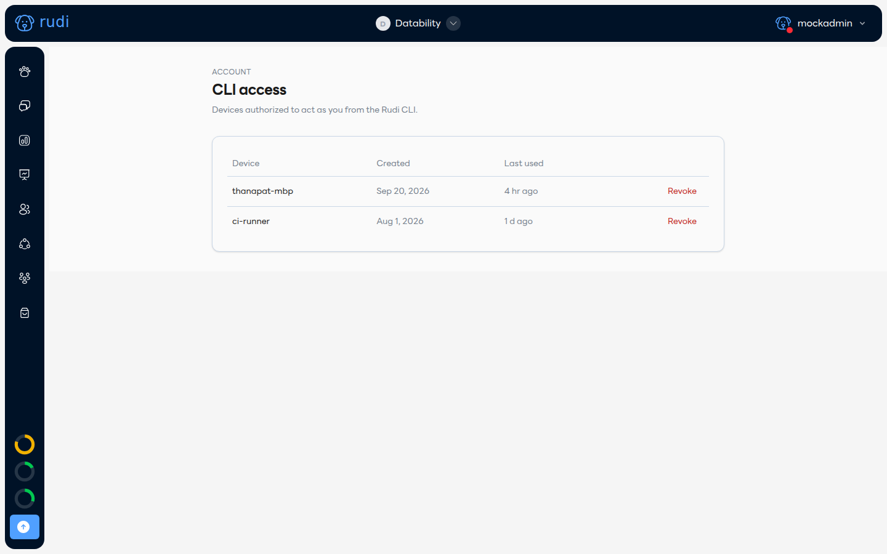

# CLI access 💻

นักพัฒนาที่ใช้ `rudi` CLI (ดู [สำหรับนักพัฒนา: เผยแพร่ Plugin ของคุณเอง](./publish-your-own-plugin.md)) ต้องล็อกอินเข้าบัญชี Rudi ก่อน — ทำครั้งเดียวต่อเครื่อง

## 1. รัน `rudi login`

```
rudi login
```

CLI จะเปิดเบราว์เซอร์ไปที่หน้า **Authorize CLI**:



ตรวจดูชื่อเครื่อง (Device) กับเวอร์ชัน CLI ว่าถูกต้อง แล้วกด **Authorize** — ถ้าไม่ได้เป็นคนสั่ง `rudi login` เอง ให้กด **Cancel** แล้วเปลี่ยนรหัสผ่านบัญชีทันที

## 2. ดู/เพิกถอนสิทธิ์ที่ล็อกอินไว้

ไปที่ **Settings → CLI access** จะเห็นทุกเครื่องที่เคยล็อกอินไว้ วันที่สร้าง และใช้งานล่าสุด:



กด **Revoke** ที่แถวไหนก็ได้เพื่อตัดสิทธิ์เครื่องนั้นทันที เช่น ตอนเปลี่ยนเครื่อง หรือสงสัยว่ามีคนอื่นใช้ token หลุด token จะหมดอายุเองภายใน 90 วันอยู่แล้วแม้ไม่ได้ Revoke
