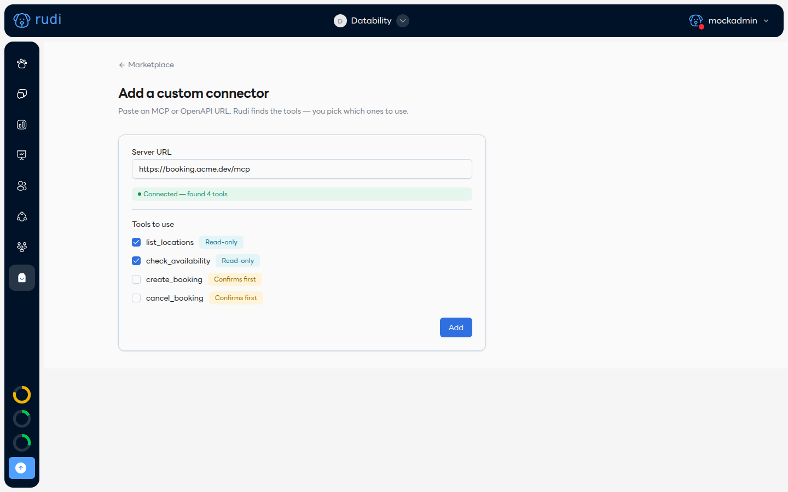

# เพิ่ม Custom connector 🔗

มีระบบของบริษัทตัวเองที่เปิด API แบบ MCP หรือ OpenAPI อยู่แล้ว? เพิ่มเป็น plugin ของทีมได้เองโดยไม่ต้องเขียน manifest เลย

ไปที่ **Marketplace → Add a custom connector** แล้ววาง URL ของ MCP หรือ OpenAPI server:

## ขั้นตอน

1. **วาง Server URL** — Rudi จะต่อเข้าไปตรวจสอบทันทีที่วางลิงก์ ถ้าเชื่อมต่อสำเร็จจะขึ้น "Connected — found N tools"
2. **เลือก Tools to use** — เครื่องมือแบบ **Read-only** จะถูกติ๊กไว้ให้อัตโนมัติ ส่วนเครื่องมือที่แก้ไขข้อมูลจริง (**Confirms first**) ต้องเลือกเองว่าจะเปิดใช้ไหม
3. กด **Add**

เสร็จแล้ว connector นี้จะกลายเป็น plugin ของทีมตามปกติ — มีหน้า Plugin ของตัวเอง (ดู [หน้า Plugin](./the-plugin-page.md)) เลือก **Use in** ผู้ช่วยได้ตามปกติ และแชร์ให้ทีมอื่นได้เหมือน plugin ที่สร้างด้วย CLI ทุกประการ

:::info
ถ้า server ต้องการ auth (bearer token, API key) Rudi จะถามตอนตรวจสอบการเชื่อมต่อ — ยังไม่รองรับ API key แบบ cookie
:::
