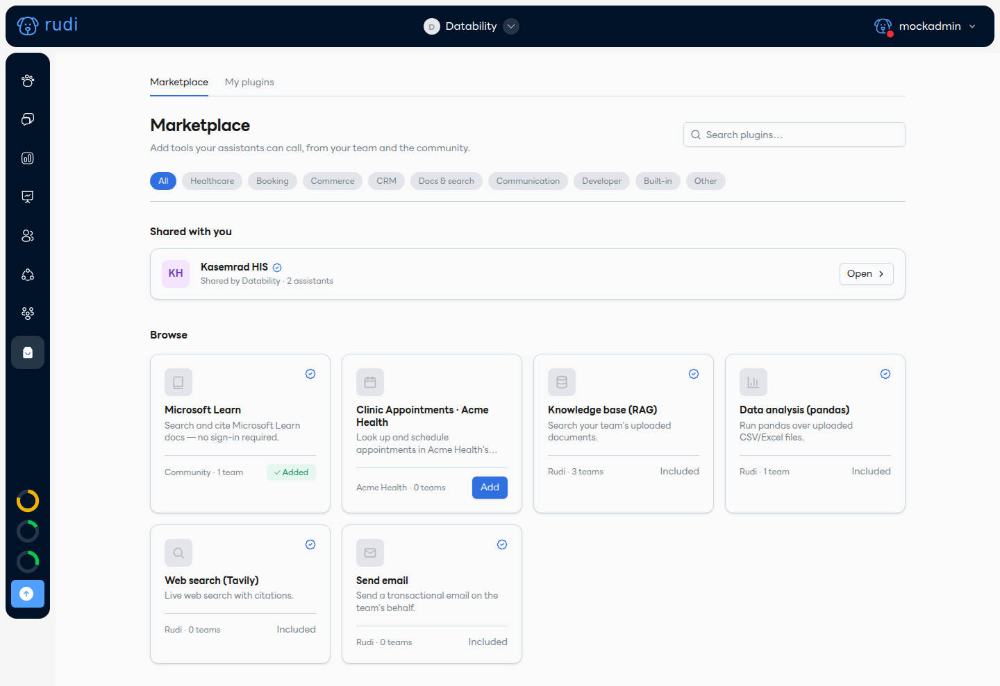
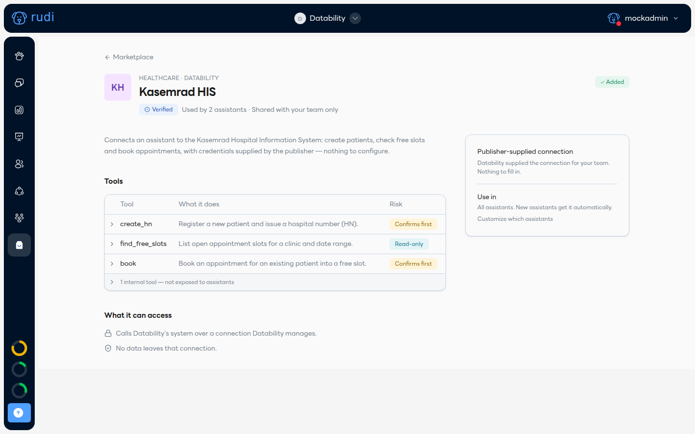
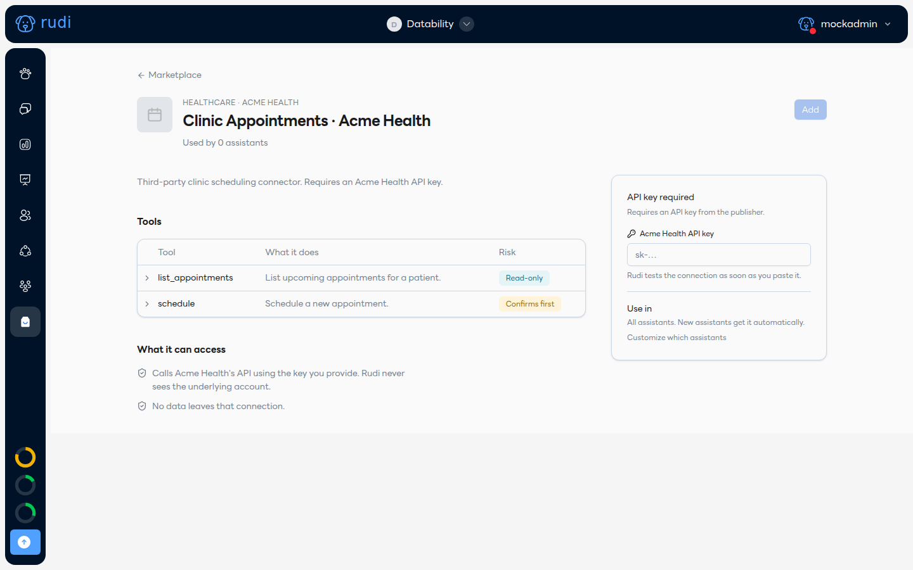

# ค้นหาและเพิ่ม Plugin 🔎

## 1. เปิด Marketplace

ไปที่เมนู **Marketplace** จะเห็น plugin ทั้งหมดที่เพิ่มได้ แบ่งเป็นแท็บ **Marketplace** (ค้นหา/เพิ่มใหม่) และ **My plugins** (ที่ทีมคุณติดตั้งแล้ว)

- ถ้ามีใครแชร์ plugin ส่วนตัวมาให้ทีมคุณ จะขึ้นในหมวด **Shared with you** บนสุดเสมอ
- กรองตามหมวดได้ด้านบน: Healthcare, Booking, Commerce, CRM, Docs & search, Communication, Developer, Built-in, Other
- ใช้ช่องค้นหามุมขวาบนได้เลย

## 2. กด Add

การ์ดที่ยังไม่ได้ติดตั้งจะมีปุ่ม **Add** หรือ **Open** (ถ้าติดตั้งแล้ว) กดเข้าไปจะเห็นหน้ารายละเอียดของ plugin นั้น:

- **สิ่งที่ทำได้ (Tools)** — ตารางเครื่องมือทั้งหมด พร้อมระดับความเสี่ยง: **Read-only** (แค่อ่าน ไม่ต้องยืนยัน) หรือ **Confirms first** (แก้ไขข้อมูลจริง ต้องให้ลูกค้ายืนยันในแชทก่อน)
- **What it can access** — บอกตรง ๆ ว่า plugin นี้เรียกอะไร ข้อมูลออกไปไหนบ้าง
- ถ้า publisher ตั้งค่าการเชื่อมต่อให้ทีมคุณไว้แล้ว (เช่นผู้ให้บริการทำระบบให้คุณโดยเฉพาะ) กล่อง **Publisher-supplied connection** จะบอกว่า "nothing to fill" — กด **Add** ได้เลย ไม่ต้องกรอกอะไร

### ถ้า plugin ต้องตั้งค่าเอง

Plugin บางตัวต้องกรอกค่าก่อนใช้ เช่น API key:

- ทุกช่องมีคำอธิบายกำกับว่าใช้ทำอะไร เอาค่ามาจากไหน
- ช่องที่เป็น secret (เช่น API key, client secret) จะถูกเข้ารหัสทันทีที่บันทึก และจะไม่แสดงค่าจริงให้เห็นอีกหลังจากนั้น

:::note Screenshot pending: ปุ่ม Test connection
สเปกกำหนดให้กดตั้งค่าแล้วมีปุ่ม **Test connection** ทดสอบก่อนกด Add จริง (✅ "Connected — found 12 free slots" หรือ ❌ ข้อความ error จากปลายทาง) — หน้าจอนี้ยังอยู่ระหว่างปรับดีไซน์ จะอัปเดตภาพเมื่อ UI สุดท้ายเสร็จ
:::

### เชื่อมต่อผ่าน OAuth

Plugin ที่รองรับ OAuth (เช่น Google, Microsoft) จะมีปุ่ม **Connect** แทนช่องกรอกรหัส — กดแล้วเข้าสู่ระบบกับผู้ให้บริการในหน้าต่างป๊อปอัป เสร็จแล้ว Rudi จะต่ออายุการเชื่อมต่อให้เองอัตโนมัติ ถ้าการเชื่อมต่อหมดอายุหรือถูกถอนสิทธิ์ plugin จะขึ้นสถานะ **Down** พร้อมปุ่ม **Reconnect**

:::note Screenshot pending: หน้าต่าง Connect (OAuth)
:::

## 3. เลือก Use in

หลัง Add สำเร็จ เลือกว่าจะเปิดใช้กับผู้ช่วย (assistant) ตัวไหนบ้าง:

- **All assistants** — เปิดกับทุกตัวที่มีอยู่ตอนนี้ (ค่าเริ่มต้น)
- สลับ **also new assistants** ไว้ (เปิดอยู่โดยดีฟอลต์) เพื่อให้ผู้ช่วยที่สร้างใหม่ทีหลังได้ plugin นี้อัตโนมัติ — ถ้าปิดไว้ ผู้ช่วยใหม่จะไม่มี ต้องมาเปิดเองทีหลัง

ปรับทีหลังได้เสมอที่ [เลือกเครื่องมือให้แต่ละผู้ช่วย](./choose-tools-for-an-assistant.md) หรือที่ [หน้า Plugin](./the-plugin-page.md) เอง

:::info
คำว่า "installation" หรือ "grant" ในเอกสารทางเทคนิคคือสิ่งเดียวกับ **Add** และ **Used by** ที่เห็นในหน้าจอ — ไม่ต้องสนใจศัพท์พวกนี้ตอนใช้งานจริง
:::
