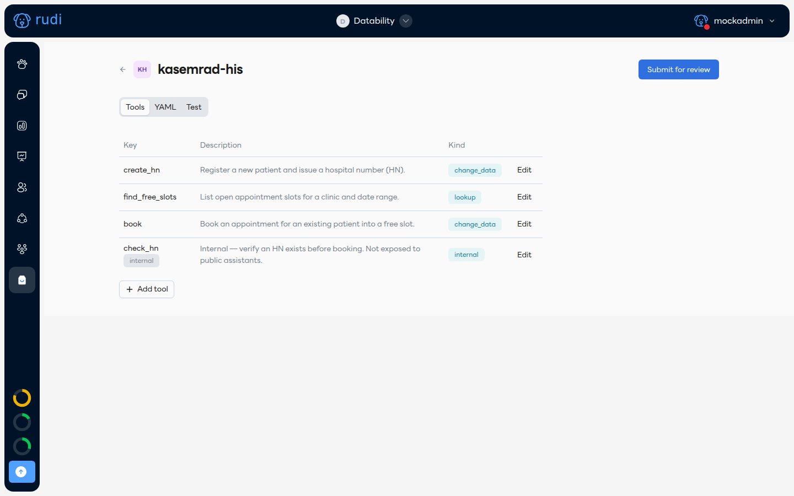

# สำหรับนักพัฒนา: เผยแพร่ Plugin ของคุณเอง 🛠️

หน้านี้สรุปเฉพาะภาพรวม — คู่มือฉบับเต็ม (ทุกคำสั่ง ทุกฟิลด์ของ manifest) อยู่ที่ developer quickstart ของ `rudi` CLI: `docs/plugins/QUICKSTART.md` และ `MANIFEST_REFERENCE.md` ในซอร์สของ `rudi-mcp`

## เริ่มจากอะไรก็ได้ที่มีอยู่แล้ว

```bash
rudi login                                        # ล็อกอินครั้งแรก — ดู CLI access
rudi plugin init --from-openapi <openapi-url>     # จาก REST API ที่มี OpenAPI spec
rudi plugin init --from-mcp <mcp-url>             # จาก MCP server
rudi plugin init my-plugin                        # เขียนเอง เริ่มจาก template เปล่า
```

`init` จะสร้าง `plugin.yaml` ที่มีคอมเมนต์กำกับทุกฟิลด์ พร้อมเดา tool, auth และฟอร์มตั้งค่า (`configSchema`) ให้จากสเปกที่ป้อนเข้าไป — ที่เหลือแค่ตรวจทานและตัดแต่ง

หรือถ้าไม่อยากแตะ YAML เลย ใช้ตัวแก้ไขในแดชบอร์ดแทนได้ (**My plugins → New plugin**) มีแท็บ Tools, YAML และ Test ให้ครบในหน้าเดียว:



## ทดสอบก่อนเผยแพร่

```bash
rudi plugin test find_free_slots          # เครื่องมือแบบ lookup
rudi plugin test book --allow-write       # เครื่องมือแบบ change_data ต้องใส่ flag นี้เสมอ
```

## เผยแพร่และแชร์

```bash
rudi plugin publish                                  # private — ทีมคุณใช้ได้ทันที
rudi plugin share my-plugin --team <teamID หรืออีเมลเชิญ>   # แชร์ให้อีกทีมหนึ่งโดยเฉพาะ
rudi plugin publish --public                         # ส่งขึ้น Marketplace ให้ทุกทีมเห็น — ต้องผ่านรีวิวก่อน
rudi plugin status                                    # เช็คว่ารีวิวถึงไหนแล้ว
```

:::note
`init` และ `test` ใช้งานได้แล้ว ส่วน `publish` / `share` / `status` ต้องรอ registry API ขึ้นโปรดักชัน — ถ้ายังใช้ไม่ได้ ให้รอประกาศอัปเดตอีกครั้ง
:::

Plugin แบบ public ทุกเวอร์ชันหลัง `1.0.0` ต้องมี changelog กำกับ และรีวิวครั้งแรกใช้เวลาไม่เกิน 2 วันทำการ — ถ้าถูกปฏิเสธจะมีเหตุผลแนบมาด้วยเสมอ เมื่อ `rudi plugin status` ใช้งานได้แล้ว จะเช็คสถานะได้ทั้งจากคำสั่งนั้นและปุ่ม **Submit for review** ที่มุมขวาบนของตัวแก้ไข (ในภาพด้านบน — แท็บที่เลือกอยู่ในภาพคือ Tools) ซึ่งใช้งานได้อยู่แล้ว
