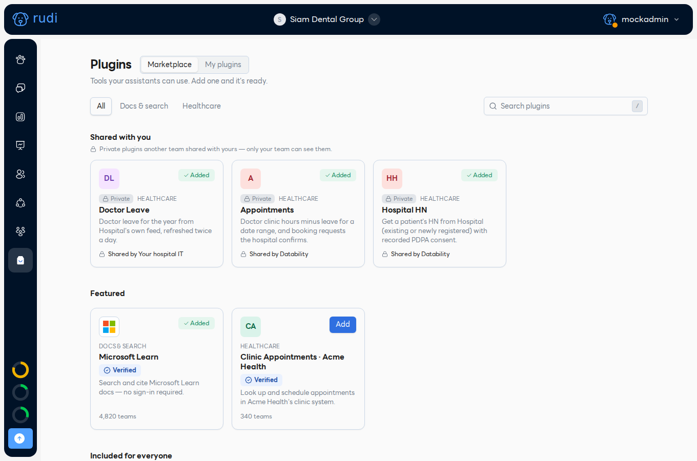
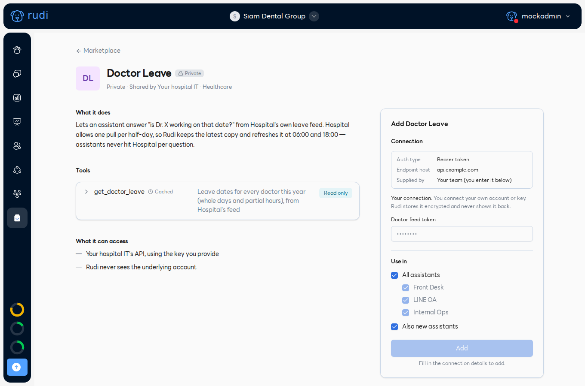
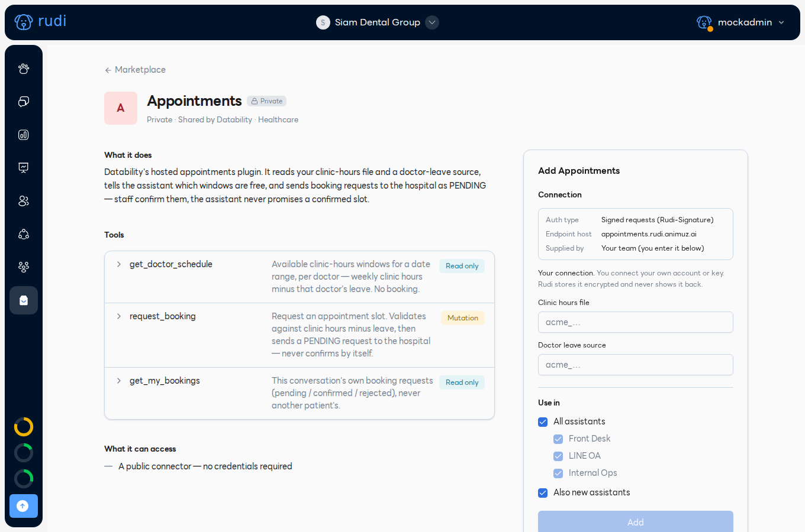
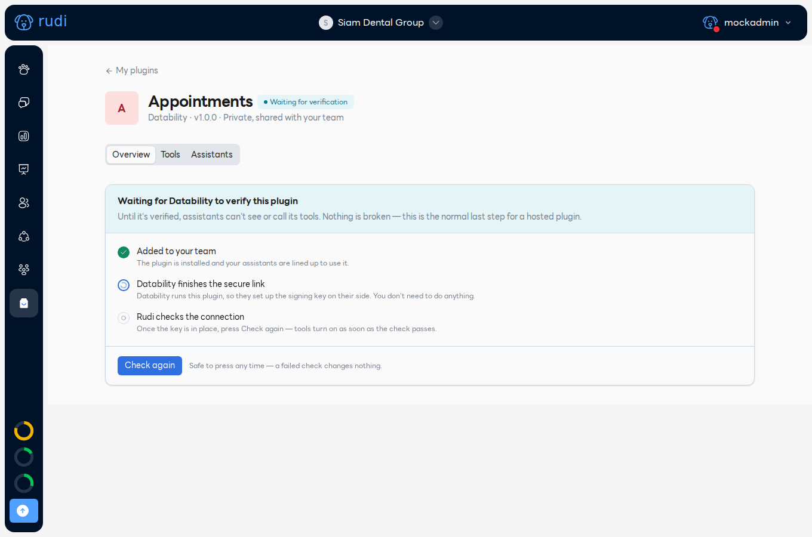
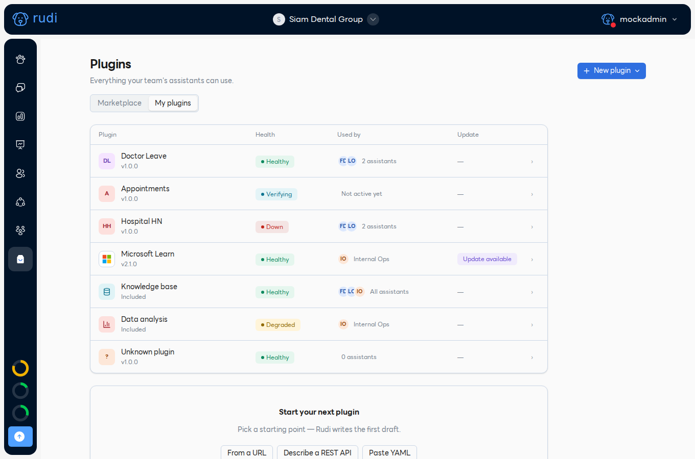
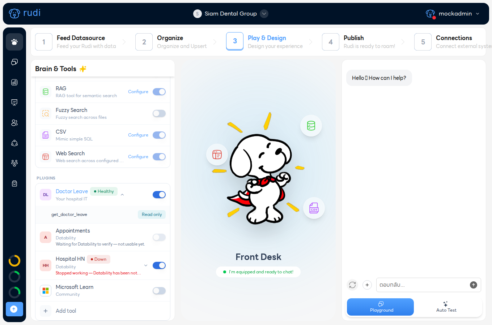
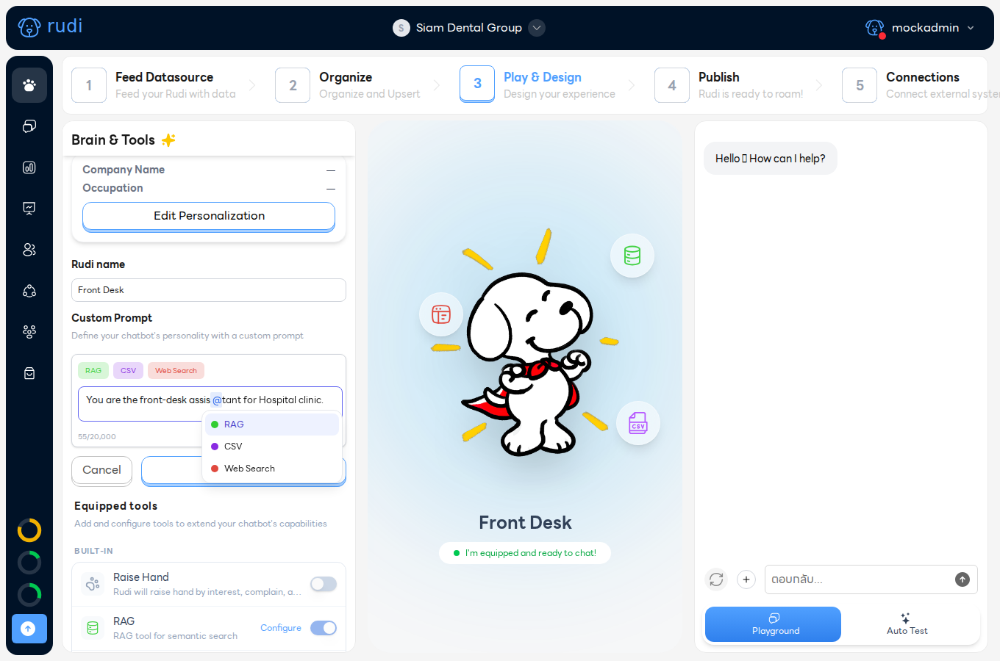

# ตั้งค่า Doctor Leave และ Appointments

เป้าหมาย: ให้ผู้ช่วยตอบ **"หมอ X ว่างวันไหน"** จากไฟล์ตารางออกตรวจและข้อมูลวันลาของแพทย์
เวลา: ประมาณ 20 นาที ผู้ทำ: แอดมินของทีม English: [Set up Doctor Leave and Appointments](./set-up-doctor-leave-and-appointments.md)

:::note อยู่ระหว่างทยอยเปิดใช้
เมนู **Plugins** ยังเปิดให้ทีละทีม ถ้าไม่เห็นไอคอนถุงที่แถบซ้าย ให้แจ้ง Datability เปิดให้ทีมคุณ
ภาพประกอบมาจากทีมสาธิตที่ใช้ข้อมูลสมมติ
:::

## ก่อนเริ่ม

| ที่ต้องมี | ได้จากไหน |
|---|---|
| Doctor Leave และ Appointments ที่ **แชร์ให้ทีมคุณแล้ว** | Datability เป็นผู้แชร์ (เป็น plugin แบบ private ไม่อยู่ในแค็ตตาล็อกสาธารณะ) |
| ไฟล์ตารางแพทย์ (`.xlsx` หรือ `.csv`) | โรงพยาบาลของคุณ ตาม[รูปแบบด้านล่าง](#2-เตรียมไฟล์ตารางแพทย์) |
| โทเคนของ feed แพทย์ | ฝ่าย IT ของโรงพยาบาล (เจ้าของ feed วันลา) |
| ผู้ช่วยที่สร้างไว้แล้ว | สร้างที่ **My Rudi** |

## 1. เข้าสู่ระบบและเลือกทีม

เข้าสู่ระบบ Rudi แล้วเลือกทีมที่แถบบน ทุกขั้นตอนต่อไปทำในทีมนี้ เปิดเมนู **Plugins** (ไอคอนถุง แถบซ้าย)

## 2. เตรียมไฟล์ตารางแพทย์

หนึ่งแถวต่อแพทย์หนึ่งคน แถวแรกต้องเป็นหัวคอลัมน์ **สะกดตรงตามนี้** ห้ามมีช่องว่างเกิน (คอลัมน์อื่นจะถูกข้าม) ชื่อแพทย์และตารางเวลาจำเป็น แผนกไม่บังคับ:

| รายชื่อแพทย์ | แผนกการรักษา | ตารางเวลาออกตรวจ |
|---|---|---|
| นพ.สมศักดิ์ ทดสอบวงศ์ | อายุรกรรม | วันจันทร์ \| 09.00-12.00 น. \| วันพุธ \| 13.00-16.00 น. |
| พญ.วิไล ตัวอย่างดี | กุมารเวชกรรม | วันอังคาร 08.00-12.00 น. \| วันศุกร์ 08.00-12.00 น. |
| ทพ.ประเสริฐ สมมติ | ทันตกรรม | ทันตกรรมวันพุธ \| 09.00-18.00 น. \| ทันตกรรมวันพฤหัสบดี \| 09.00-18.00 น. |

(ชื่อทั้งหมดเป็นชื่อสมมติ)

กติกาที่ระบบใช้:

- **ชื่อแพทย์**: คำนำหน้า เช่น นพ. พญ. ทพ. ทพญ. นายแพทย์ แพทย์หญิง Dr. จะถูกตัดออกก่อนเทียบชื่อ ชื่อต้องตรงกับชื่อใน feed วันลาหลังตัดคำนำหน้า
- **ตารางเวลา**: ใช้ **ชื่อวันภาษาไทย** (จันทร์ อังคาร พุธ พฤหัสบดี ศุกร์ เสาร์ อาทิตย์) ตามด้วยช่วงเวลา `HH.MM-HH.MM` (ใช้ `:` ได้) คั่นด้วย `|` `,` `/` หรือขึ้นบรรทัดใหม่ วันเดียวมีหลายช่วงได้ เขียน **หนึ่งวันต่อหนึ่งรายการ**: ช่วงวัน (จันทร์-ศุกร์) ตัวย่อ (จ. พ.) และคำว่า "และ" ระหว่างเวลา **อ่านไม่ได้** และช่วงวันจะเหลือเฉพาะวันสุดท้ายโดยไม่แจ้งเตือน ใส่ `(สัปดาห์ที่ 1 3 5)` เพื่อจำกัดบรรทัดนั้นเฉพาะครั้งที่ 1, 3 และ 5 ที่วันนั้นตรงกับในเดือน (วันที่ 1-7, 15-21, 29-31) ไม่ใช่สัปดาห์ตามปฏิทิน ช่วงข้ามคืน (20.00-08.00) นับถึง 23:59 เท่านั้น
- **แผนก**: เขียนหลังเวลา หรือหน้าชื่อวัน (`ทันตกรรมวันพุธ`) หรือใช้ค่าจากคอลัมน์ `แผนกการรักษา`
- แถวที่ชื่อหรือตารางว่างจะถูกข้าม ตารางที่เขียนเป็นวันภาษาอังกฤษ **อ่านไม่ได้**
- `.xlsx` อ่านเฉพาะ **ชีตแรก** (ไม่รองรับ `.xls` ให้บันทึกเป็น `.xlsx`) ส่วน `.csv` ต้องเป็น UTF-8 (ใน Excel: Save As → CSV UTF-8 ไม่เช่นนั้นภาษาไทยเพี้ยน) ขนาดไม่เกิน 25 MB

อัปโหลดไฟล์ที่ **Feed Datasource** (ขั้นแรกของผู้ช่วย) พาธของไฟล์ **ขึ้นต้นด้วย `txt/` เสมอ** (ในหน้าจอไม่แสดง): ไฟล์ในโฟลเดอร์ `doctors` คือ `txt/doctors/schedule.xlsx` ไฟล์ระดับบนสุดคือ `txt/schedule.xlsx` ถ้าจะเปลี่ยนตาราง ให้ลบไฟล์เก่าใน Feed Datasource แล้วอัปโหลดไฟล์ใหม่ชื่อและพาธเดิม

## 3. เพิ่ม Doctor Leave

1. เปิด **Plugins → Marketplace** ที่หมวด **Shared with you** เปิด **Kasemrad Doctor Leave** (เรียกว่า Doctor Leave) plugin นี้อ่านข้อมูลจาก feed วันลาของ Kasemrad โรงพยาบาลอื่นต้องขอ plugin วันลาของตัวเองจาก Datability
2. ดูรายการ **Tools**: `get_doctor_leave` เป็น Read only (อ่านวันลาอย่างเดียว)
3. วาง **Doctor feed token** ที่ได้จาก IT โรงพยาบาล ระบบเก็บแบบเข้ารหัสและจะไม่แสดงให้เห็นอีก
4. ที่ **Use in** ติ๊กผู้ช่วยที่จะใช้ **All assistants** ครอบคลุมผู้ช่วยที่สร้างทีหลังด้วย (**Also new assistants**)
5. กด **Add** ถ้าโทเคนผิดจะขึ้น **Couldn't connect** พร้อมเหตุผล และไม่มีอะไรถูกบันทึก

ข้อมูลวันลารีเฟรชวันละ 2 ครั้ง (06:00 และ 18:00 เวลาไทย) วันลาที่เพิ่งกรอกอาจใช้เวลาถึง 12 ชั่วโมงกว่าจะปรากฏ

## 4. เพิ่ม Appointments

1. เปิด **Appointments** ในหมวด **Shared with you** เครื่องมือ:
   - `get_doctor_schedule` (Read only): ช่วงเวลาว่างตามช่วงวันที่ (ไม่เกิน 31 วัน) ต่อแพทย์หรือแผนก
   - `get_my_bookings` (Read only): คำขอจองของแชทนี้
   - `request_booking` (**Mutation**): ส่งคำขอสถานะ **pending** ให้โรงพยาบาล ไม่เคยยืนยันการจองเอง เจ้าหน้าที่ยืนยันภายหลัง
2. กรอก 2 ช่อง (ดู[ข้อจำกัดในปัจจุบัน](#ข้อจำกัดในปัจจุบัน)):
   - **Clinic hours file**: พาธจากขั้น 2 เช่น `txt/doctors/schedule.xlsx`
   - **Doctor leave source**: `<plugin id>.get_doctor_leave` เปิด Doctor Leave จาก **Marketplace → Shared with you** (ไม่ใช่จาก My plugins) แล้วคัดลอกส่วนที่ตามหลัง `/detail/` ในแถบที่อยู่: `…/plugins/detail/<plugin id>`
3. เลือก **Use in** แล้วกด **Add**

## 5. รอ Datability ยืนยัน

Appointments เป็น plugin ที่ Datability โฮสต์ หลังกด **Add** จะขึ้น **Waiting for verification** และเครื่องมือยังปิดอยู่ Datability จะตั้งค่าความปลอดภัยครั้งเดียวให้เสร็จ จากนั้นกด **Check again** เมื่อผ่านแล้วป้ายจะเปลี่ยนเป็น **Connected**

ดูสถานะของทั้งสอง plugin ได้ที่ **Plugins → My plugins** (เวอร์ชัน สถานะ ผู้ช่วยที่ใช้อยู่)

## 6. เปิดใช้กับผู้ช่วย

เปิดผู้ช่วย → **Step 3: Play & Design** → **Equipped tools → Plugins** ตรวจว่าสวิตช์ **Doctor Leave** และ **Appointments** เปิดอยู่ (เปิดให้แล้วถ้าติ๊ก **Use in** ตอน Add; Appointments จะปิดอยู่จนกว่าจะยืนยันเสร็จ) กดชื่อ plugin เพื่อดูเครื่องมือและระดับความเสี่ยง

- สวิตช์เป็นแบบรายตัว plugin ปิดเครื่องมือทีละตัวไม่ได้ ดังนั้น `request_booking` มาพร้อม Appointments
- ที่ **Custom Prompt** เขียนคำสั่งเป็นภาษาปกติ เช่น *"ห้ามบอกว่าการจองยืนยันแล้ว ให้บอกว่าโรงพยาบาลจะยืนยันกลับ"* การพิมพ์ `@` ตอนนี้แสดงเฉพาะเครื่องมือในตัว (RAG, CSV, Web Search) เครื่องมือของ plugin จะถูกใช้เองเมื่อเกี่ยวข้อง

## 7. ทดสอบใน Playground

ที่ Step 3 ใช้แท็บ **Playground** ด้านขวา ลองถาม:

| ถาม | ควรได้ |
|---|---|
| "พญ.วิไลว่างวันศุกร์นี้ไหม" | ช่วงเวลาว่าง เช่น 08:00-12:00 |
| "แผนกทันตกรรมสัปดาห์หน้ามีใครออกตรวจบ้าง" | ช่วงเวลาของทันตแพทย์แต่ละท่าน |
| "นพ.สมศักดิ์ออกตรวจวันพุธที่ 14 ตุลาคมไหม" | ลาตามที่ feed ระบุ และแยกคำตอบระหว่าง *ไม่มีคลินิกวันนั้น* กับ *ลา* |
| "ขอจอง พญ.วิไล เช้าวันศุกร์" (วันที่ล่วงหน้าอย่างน้อยครึ่งวัน ใช้ชื่อแพทย์ตรงตัว) | ขอเลขบัตรประชาชน แล้วแจ้งว่า **รับคำขอแล้ว** โรงพยาบาลจะยืนยันกลับ ไม่เช่นนั้นจะปฏิเสธอย่างสุภาพ |
| "ดูการจองของฉัน" | แสดงคำขอของแชทนี้ พร้อมสถานะ pending/confirmed/rejected |

คำขอจองเป็นระเบียนจริงสถานะ pending เจ้าหน้าที่อาจเห็นใน LINE digest ควรแจ้ง Datability ก่อนทดสอบการจอง ระเบียนการจองเก็บเลขบัตรเพียง 4 ตัวท้าย แต่ตัวแชทยังมีสิ่งที่พิมพ์ไว้ครบ ใช้ข้อมูลทดสอบ ไม่ใช่ผู้ป่วยจริง

## แก้ปัญหา

ในแชท ผู้ช่วยอาจเรียบเรียงข้อความผิดพลาดใหม่ ถ้อยคำจึงอาจต่างจากในตาราง

| สิ่งที่เห็น | ความหมาย | วิธีแก้ |
|---|---|---|
| **Couldn't connect** ตอนกด Add | ปลายทางปฏิเสธโทเคน | ตรวจโทเคนกับ IT โรงพยาบาลอีกครั้ง |
| **Waiting for verification** นานผิดปกติ | Datability ยังไม่ได้ตั้งค่ากุญแจ | ส่งข้อมูลตามหัวข้อด้านล่าง |
| ป้าย **Down** (แดง) | โทเคนถูกปฏิเสธหรือบริการหยุด เครื่องมือถูกซ่อน | ขอโทเคนใหม่จาก IT โรงพยาบาลแล้วส่งให้ Datability (ปุ่มแดง **Update connection** ยังใช้ไม่ได้) |
| **Update available** | มีเวอร์ชันใหม่ | ขอให้ Datability อัปเกรด |
| "could not fetch clinic hours" | พาธผิด หรือไฟล์ไม่อยู่ในเอกสารของทีม | ตรวจพาธใน Feed Datasource |
| "could not fetch doctor leave" | ยังไม่ได้เพิ่ม Doctor Leave, เป็น Down หรือ id ผิด | ดูที่ **My plugins** กรอก `<plugin id>.get_doctor_leave` ใหม่ |
| "No doctor matching … Did you mean" | ชื่อไม่ตรงกับในไฟล์ | ใช้ชื่อที่ระบบแนะนำ หรือแก้ไฟล์ |
| "date range too long" | ช่วงเกิน 31 วัน | ถามช่วงที่สั้นลง |
| ทุกคนขึ้น *ไม่มีเวลาออกตรวจ* | อ่านตารางไม่ออก (เช่น ใช้วันภาษาอังกฤษ) | เขียนใหม่ตาม[รูปแบบด้านบน](#2-เตรียมไฟล์ตารางแพทย์) |
| หมอลาแต่ยังขึ้นว่าว่าง | feed วันลาแคชได้ถึง 12 ชั่วโมง หรือชื่อไม่ตรง | รอรอบ 06:00/18:00 และเทียบชื่อ |

## ข้อจำกัดในปัจจุบัน

- ยังไม่มีตัวเลือกไฟล์/เครื่องมือ (picker): สองช่องของ Appointments เป็นกล่องข้อความ ต้องพิมพ์พาธและ id เอง
- เพิ่ม plugin จากแค็ตตาล็อกสาธารณะไม่ได้ Datability ต้องแชร์ให้ก่อน
- Appointments ต้องให้ Datability ยืนยันครั้งแรก
- ปิดเครื่องมือทีละตัวไม่ได้ และ `@` ไม่แสดงเครื่องมือของ plugin
- ปุ่มแดง **Update connection** ของ plugin ที่เป็น Down ยังไม่ทำงาน

## ถ้าติดปัญหา ส่งข้อมูลนี้ให้ Datability

1. ชื่อทีมและชื่อผู้ช่วย
2. ชื่อ plugin และที่อยู่หน้าของมันใน **My plugins**
3. ข้อความที่ขึ้นแบบตรงตัว เวลาที่เกิด และภาพหน้าจอ
4. ชื่อไฟล์และพาธ (ห้ามส่งข้อมูลผู้ป่วย)
5. สิ่งที่ถามใน Playground และคำตอบที่ได้

ส่งให้ผู้ติดต่อของคุณที่ Datability
