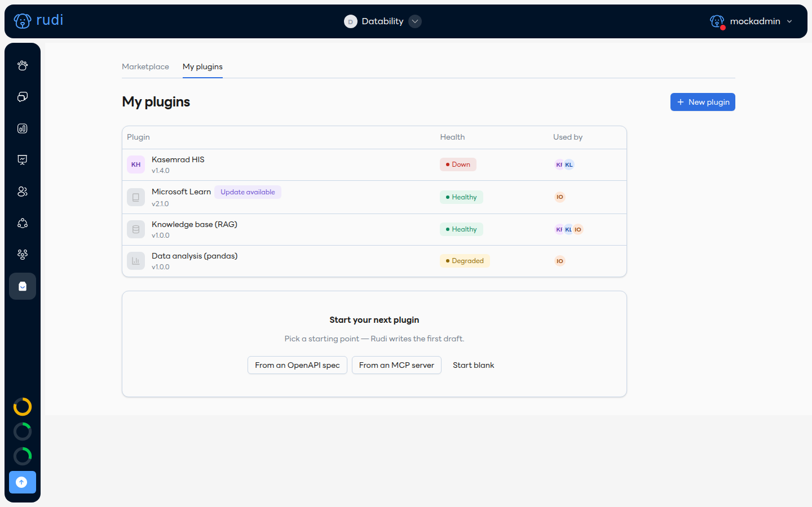
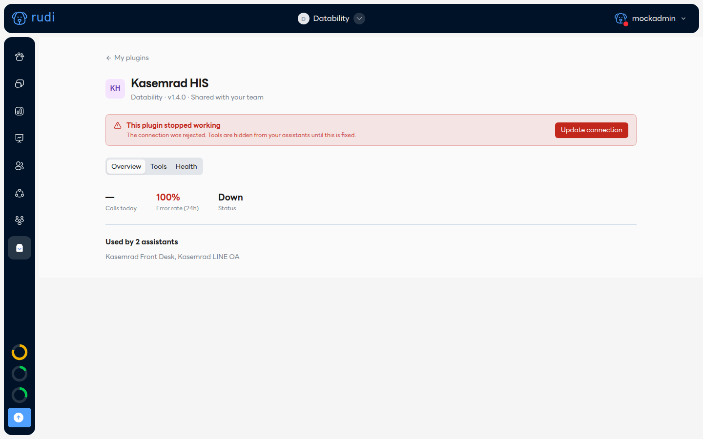
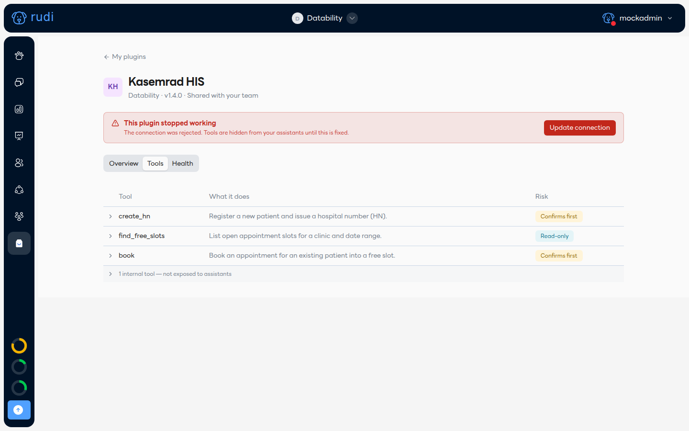
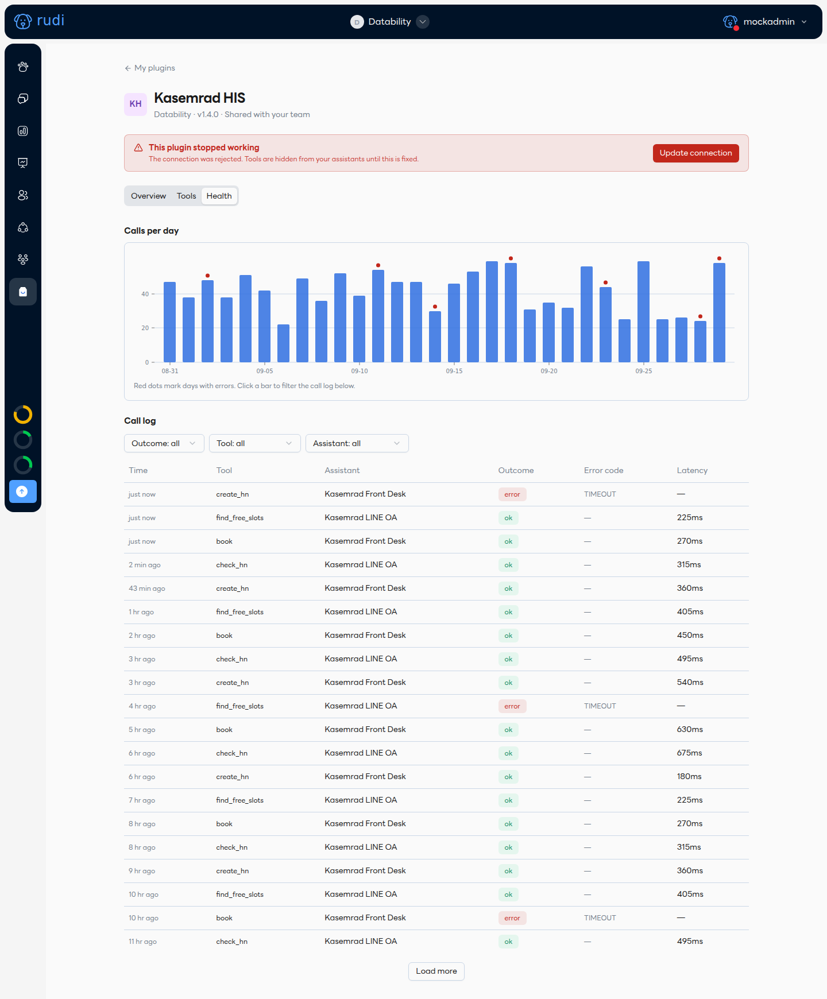

# หน้า Plugin 📋

ทุก plugin ที่ทีมคุณติดตั้งมีหน้าของตัวเอง เปิดได้จาก **My plugins**:

รายการนี้แสดงเวอร์ชันที่ติดตั้งอยู่ สถานะ (Health) และใช้อยู่กับผู้ช่วยตัวไหนบ้าง (ตัวย่อสีในคอลัมน์ Used by)

## 1. สถานะการทำงาน (Health)

| สถานะ | ความหมาย | ควรทำอะไร |
|---|---|---|
| 🟢 **Healthy** | ทำงานปกติ | ไม่ต้องทำอะไร |
| 🟡 **Degraded** | ปลายทางช้าหรือหลุดเป็นพัก ๆ | เครื่องมือยังเปิดให้ใช้อยู่ แต่บางคำสั่งอาจตอบช้า/พลาดบ้าง ลองดูแท็บ Health ว่ามี error วันไหนมากผิดปกติไหม |
| 🔴 **Down** | หยุดทำงาน — เช่นรหัสผ่าน/API key ถูกปฏิเสธ | เครื่องมือของ plugin นี้จะถูกซ่อนจากผู้ช่วยทันทีจนกว่าจะแก้ไข ระบบจะส่งอีเมลแจ้งแอดมินทีมด้วย |
| 🔴 **Blocked** | เวอร์ชันที่ติดตั้งอยู่ถูก **แอดมิน Rudi** เรียกคืน (yank) ด้วยเหตุผลด้านความปลอดภัย/การใช้งานผิดวัตถุประสงค์ หรือ MCP plugin เปลี่ยนเครื่องมือฝั่งต้นทางไปจากตอนเผยแพร่ (`TOOL_CHANGED_UPSTREAM`) | เครื่องมือถูกซ่อนเหมือน Down แต่ทางแก้ต่างกัน: แบนเนอร์จะบอกเหตุผลพร้อมเวอร์ชันที่ต้องอัปเกรดไป เช่น "Upgrade to 1.2.0" ไม่ใช่การแก้ค่าเชื่อมต่อ |

เมื่อ plugin หยุดทำงาน จะมีแบนเนอร์สีแดงบอกสาเหตุและปุ่มแก้ไขตรงบนสุดของหน้า:

กดปุ่มสีแดง (เช่น **Update connection** หรือ **Reconnect**) เพื่อแก้ไขค่าที่ผิดพลาด — เมื่อเชื่อมต่อสำเร็จ เครื่องมือจะกลับมาใช้ได้ทันที

## 2. Update available

ถ้ามีเวอร์ชันใหม่กว่าที่ติดตั้งอยู่ จะมีป้าย **Update available** ต่อท้ายชื่อ plugin ใน My plugins (ดูตัวอย่าง Microsoft Learn ด้านบน) เวอร์ชันที่ติดตั้งอยู่จะ **ไม่อัปเดตเองอัตโนมัติ** — ต้องเข้าไปกดอัปเดตเอง และจะเห็นสรุปสิ่งที่เปลี่ยนแปลง (changelog) ก่อนตัดสินใจ

## 3. แท็บ Tools

แสดงเครื่องมือทั้งหมดในเวอร์ชันที่ติดตั้งอยู่ พร้อมระดับความเสี่ยง (Read-only / Confirms first) เหมือนหน้ารายละเอียดใน Marketplace:

:::note Screenshot pending: ปุ่ม Try it
แต่ละเครื่องมือจะมีปุ่ม **Try it** ให้ทดสอบได้จากหน้านี้เลย — เครื่องมือแบบ read-only จะรันจริงและแสดงผลลัพธ์ เครื่องมือแบบ Confirms first จะแสดงแค่ "จะส่งอะไรไป" โดยไม่ยิงจริง ยังอยู่ระหว่างพัฒนา
:::

## 4. แท็บ Health

กราฟจำนวนการเรียกใช้ต่อวัน 30 วันล่าสุด จุดสีแดงคือวันที่มี error และตารางประวัติการเรียก (call log) ย้อนหลัง 90 วัน กรองตามผลลัพธ์/เครื่องมือ/ผู้ช่วยได้ คลิกที่แท่งกราฟวันไหนจะกรองตารางด้านล่างให้อัตโนมัติ:

:::info
ตาราง call log เก็บแค่ เวลา เครื่องมือ ผู้ช่วย ผลลัพธ์ รหัส error และความหน่วง (latency) — **ไม่เก็บเนื้อหาหรือพารามิเตอร์ที่ส่งไปในการเรียกแต่ละครั้ง** ข้อมูลลูกค้าจึงไม่ถูกบันทึกไว้ในนี้
:::
