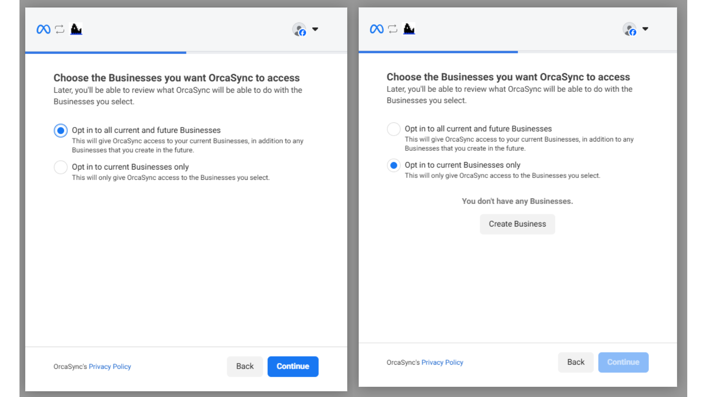
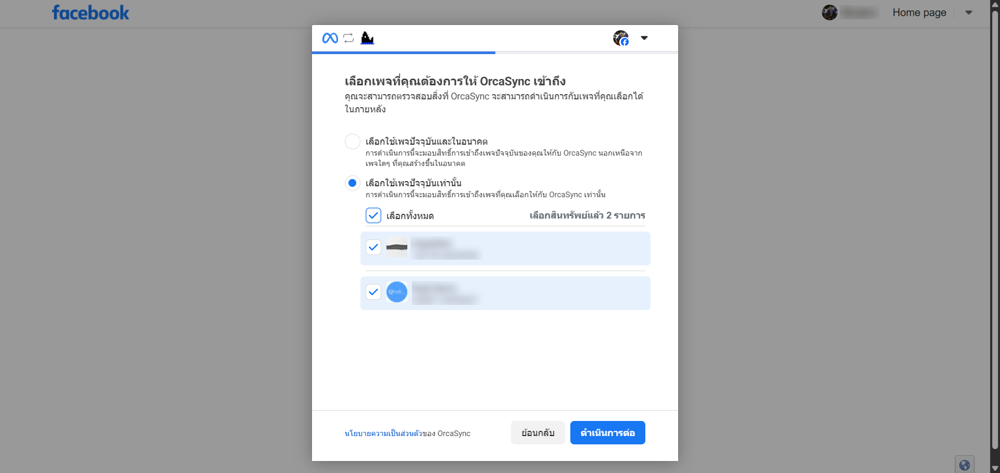

# Facebook Page

### การเชื่อมต่อ Rudi กับ Facebook Page

1. ไปที่เว็บไซต์ [Rudi Website](https://app.rudi.animuz.ai/app/rudi)

2. ไปที่เมนู Sync

3. คลิกปุ่ม New Social Media

4. เลือก Assistant

5. เลือก Facebook Platform คลิก Connect to Facebook

6. เลือก Facebook Page ที่คุณต้องการให้ OrcaSync เข้าถึง

### กรณี Facebook Page อยู่ภายใต้ Business

- หากเพจอยู่ภายใต้ธุรกิจ ให้เลือกใช้ธุรกิจปัจจุบันที่ตรงกับธุรกิจที่เพจอยู่ภายใต้ หรือ เลือกใช้ธุรกิจปัจจุบันและในอนาคต

### กรณี Facebook Page ไม่ได้อยู่ภายใต้ Business

- Facebook Page ที่ไม่ได้อยู่ภายใต้ธุรกิจ ไม่จำเป็นต้องเลือกธุรกิจ หรือ เลือกใช้ธุรกิจปัจจุบันและในอนาคต

### เชื่อมต่อหลายเพจพร้อมกัน

- หากต้องการเชื่อมต่อหลายเพจในครั้งเดียว ให้คลิกเลือกทั้งหมด เพื่อเชื่อมต่อในครั้งเดียว

7. คลิก บันทึก เพื่อเชื่อมต่อ Rudi กับ Facebook Page Messenger

:::info["Tip"]

### หากเชื่อมต่อหลายเพจ จะเลือก Assistant ได้เพียง 1 ตัว

- หากต้องการเปลี่ยน Assistant ในภายหลัง ให้คลิกที่ Assistant เพื่อแก้ไข

- เลือก Assistant ใหม่จากหน้าต่างที่แสดงขึ้นมา

## คลิปวิดีโอ สำหรับการเปลี่ยน Assistant

<iframe width="560" height="315" src="https://www.youtube.com/embed/09QyTfuqOpM" title="YouTube video player" frameborder="0" allow="accelerometer; autoplay; clipboard-write; encrypted-media; gyroscope; picture-in-picture; web-share" referrerpolicy="strict-origin-when-cross-origin" allowfullscreen></iframe>
:::

:::success
หากขั้นตอนถูกต้องทั้งหมด ระบบจะแสดงผลการเชื่อมต่อกับ Facebook Page Messenger ดังภาพ:
:::

## คลิปวิดีโอ สำหรับการทำงานทั้งหมด

<iframe width="560" height="315" src="https://www.youtube.com/embed/5mJqObnKssM" title="YouTube video player" frameborder="0" allow="accelerometer; autoplay; clipboard-write; encrypted-media; gyroscope; picture-in-picture; web-share" referrerpolicy="strict-origin-when-cross-origin" allowfullscreen></iframe>
