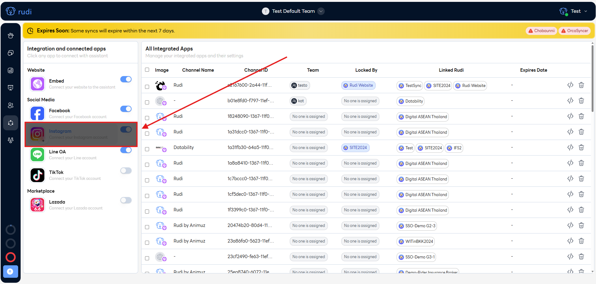
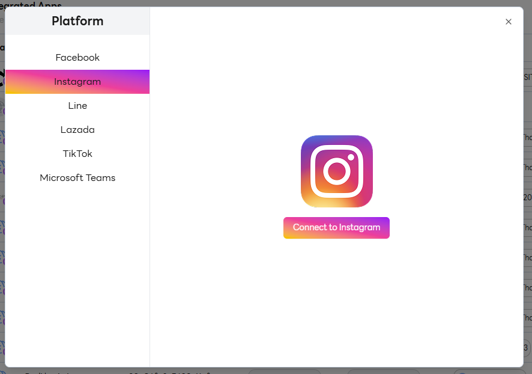
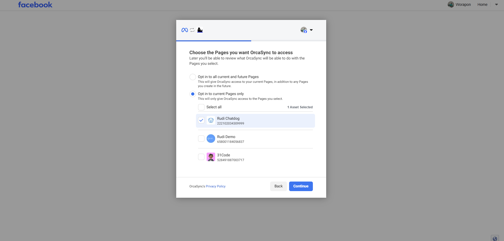
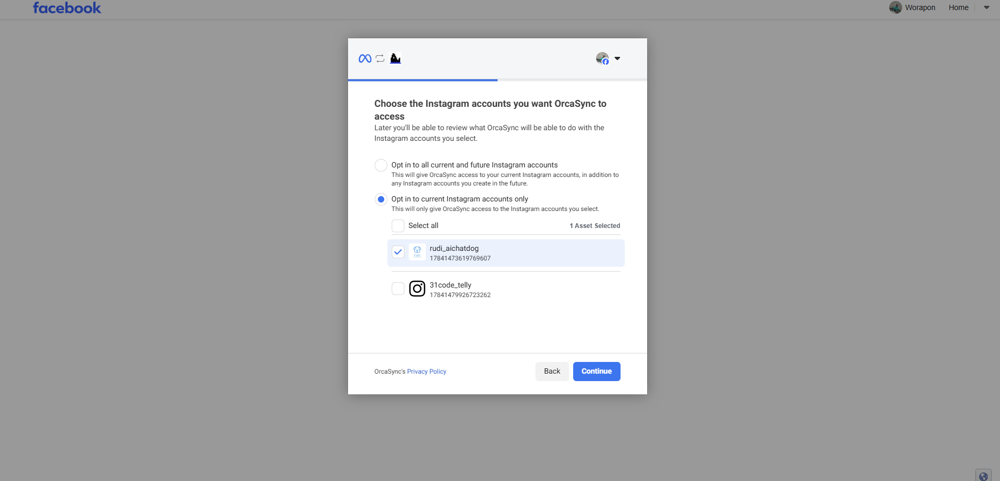

# Instagram

### การเชื่อมต่อ Rudi กับ Instagram

1. ไปที่เว็บไซต์ [Rudi Website](https://app.rudi.animuz.ai/app/rudi)

2. ไปที่เมนู Sync

3. เลือกเมนู Instagram

4. คลิกปุ่ม Connect to Instagram

5. เลือก Page ที่ต้องการเชื่อมต่อ

6. เลือก Account Instagram ที่ต้องการเชื่อมต่อ

7. เสร็จสิ้น
