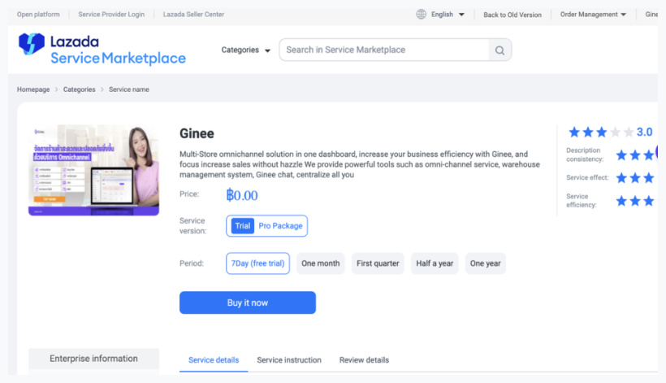

# Lazada

## ขั้นตอนการเชื่อมต่อร้านค้ากับแอปใน Lazada Open Platform และมอบสิทธิ์ให้ Datability

### เชื่อมต่อแอปใน Lazada Open Platform

1. ร้านค้าจะได้รับลิงก์ URL สำหรับเข้าสู่ระบบ

2. เข้าสู่ระบบด้วยบัญชีผู้ขาย แล้วคลิก Buy it now (โดยไม่มีค่าใช้จ่าย ตามเงื่อนไขของแอป)

3. ยืนยันการซื้อบริการ

4. ระบบจะแสดงหน้าจอยืนยันการซื้อสำเร็จ

5. สามารถตรวจสอบสถานะการซื้อได้ในระบบ

6. เมื่อเรียบร้อยแล้ว สามารถปิดหน้าต่างได้

### มอบสิทธิ์ให้กับ Datability

ร้านค้าจะได้รับลิงก์ URL และกรอกข้อมูลเพื่อเข้าสู่ระบบอีกครั้ง

:::success
หลังจากเข้าสู่ระบบแล้ว ระบบจะนำทางไปยังหน้าถัดไปโดยอัตโนมัติ เพื่อมอบสิทธิ์ให้ Datability
:::
