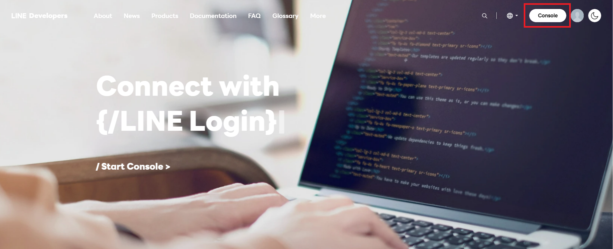
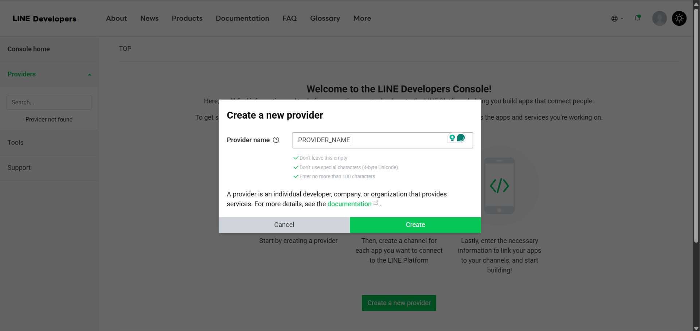
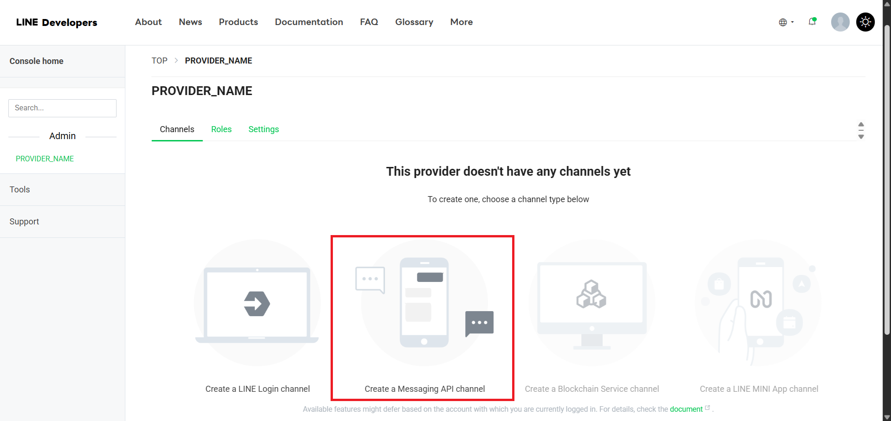
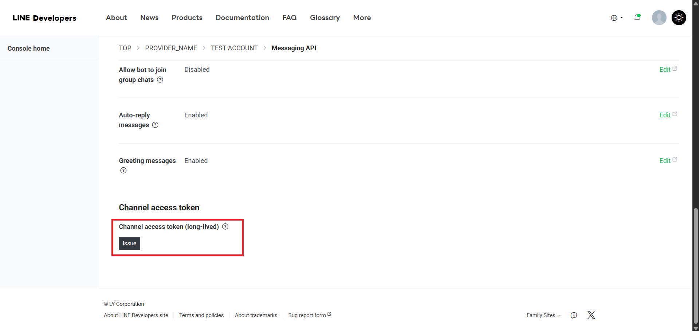
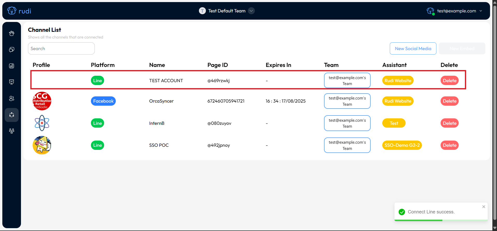

# LINE Official Account

### ขั้นตอนการสร้าง Provider บน LINE Developers

1. ไปที่เว็บไซต์ [LINE Developers](https://developers.line.biz)
2. คลิกปุ่ม Console

:::info["Note"]
หากยังไม่เคยใช้งานระบบ จะต้องกรอกข้อมูลLine Developers Console ก่อน

:::

3. คลิก Create a new provider เพื่อสร้าง Provider ใหม่

- กรอกชื่อ Provider

4. เลือก Create a new channel แล้วเลือกประเภท Messaging API

:::info[]
หากยังไม่เคยสร้าง Channel มาก่อน ระบบจะให้เลือกประเภทของ Channel  
ให้เลือกเป็น Messaging API เพื่อใช้เชื่อมต่อกับแชทบอท

:::

1. คลิก Create LINE Official Account

### ขั้นตอนการสร้าง LINE Official Account

6. กรอกข้อมูลของ LINE Official Account ผ่านเว็บไซต์ [LINE Business](https://manager.line.biz/)

### ขั้นตอนการเชื่อมต่อ Provider กับ Line Official Account

7. กดเลือกบัญชี Line Official Account ที่สร้าง

คลิกที่ปุ่ม ตั้งค่า

8. ไปที่เมนู Messaging API แล้วคลิก ใช้งาน Messaging API

9. เลือก Provider ที่สร้างไว้ก่อนหน้านี้

10. เมื่อตั้งค่า Provider เสร็จแล้ว ระบบจะให้กรอกลิงก์ Webhook  
    หากคุณยังไม่มีระบบปลายทาง สามารถใส่ลิงก์ ตัวอย่างไปก่อน เช่น `https://example.com`  
    เพียงเพื่อให้สามารถเปิดใช้งาน Webhook ได้ในขั้นตอนถัดไป จากนั้นคลิก บันทึก

11. ไปที่เมนู ตั้งค่าการตอบกลับ แล้วคลิกเพื่อเปิดใช้งาน Webhook

### ขั้นตอนการสร้าง Access Token

12. กลับไปที่เว็บไซต์ LINE Developers Console แล้วเลือก Channel ที่สร้างไว้

13. ไปที่เมนู Messaging API

14. เลื่อนลงไปด้านล่างสุด แล้วคลิกปุ่ม Issue เพื่อสร้าง Access Token

:::info[]
หลังจากคลิกแล้ว ระบบจะแสดง Access Token ขึ้นมา  
ให้คลิกปุ่มคัดลอก เพื่อเก็บรหัสนี้ไว้ใช้งาน

  
:::

### ขั้นตอนการซิงค์กับ Rudi

15. ไปที่เว็บไซต์ [Rudi Website](https://app.rudi.animuz.ai/app/rudi)
16. ไปที่เมนู Sync

17. คลิกปุ่ม New Social Media

18. เลือก Assistant

19. เลือก LINE Platform
20. วาง Access Token ลงในช่องที่กำหนด แล้วคลิก Connect to LINE

:::success
หากขั้นตอนถูกต้องทั้งหมด ระบบจะแสดงผลการเชื่อมต่อกับ Line Official Account ดังภาพ:
:::

## คลิปวิดีโอ สำหรับการทำงานทั้งหมด

<iframe width="560" height="315" src="https://www.youtube.com/embed/aU_I4tSANyw" title="YouTube video player" frameborder="0" allow="accelerometer; autoplay; clipboard-write; encrypted-media; gyroscope; picture-in-picture; web-share" referrerpolicy="strict-origin-when-cross-origin" allowfullscreen></iframe>
