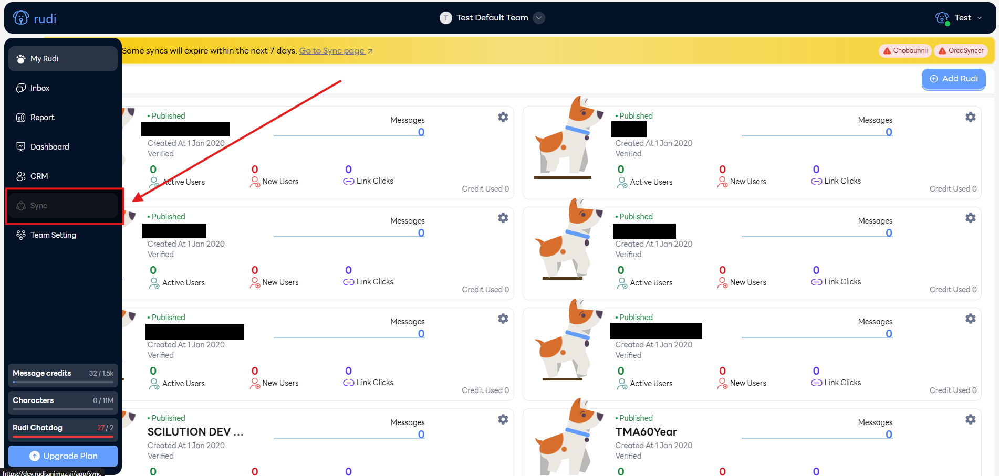
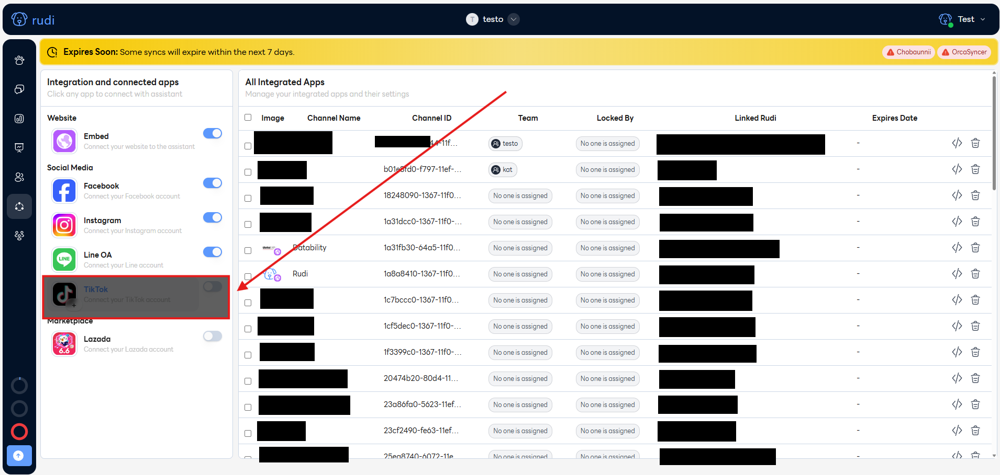
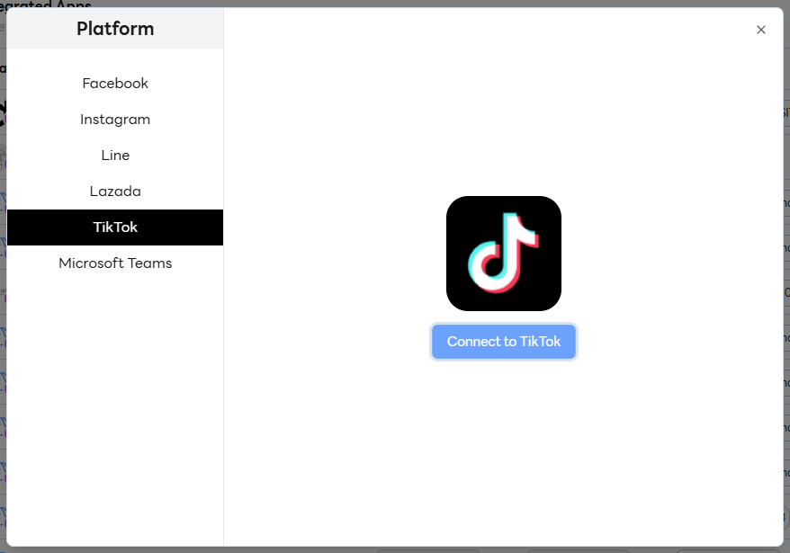
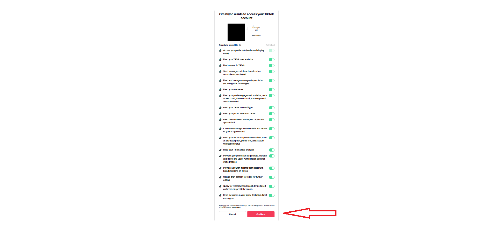

# Tiktok

### การเชื่อมต่อ Rudi กับ Tiktok

1. ไปที่เว็บไซต์ [Rudi Website](https://app.rudi.animuz.ai/app/rudi)

2. ไปที่เมนู Sync

3. เลือกเมนู Tiktok

4. คลิกปุ่ม Connect to Tiktok

5. คลิกปุ่ม Continue

6. เสร็จสิ้น
