# WhatsApp Business 📞

เชื่อมต่อ **Rudi** เข้ากับ **WhatsApp Business Platform (Cloud API)** เพื่อให้ตอบลูกค้าได้อัตโนมัติ 💬

:::info["ข้อควรรู้ ⚠️"]

### 1. เบอร์โทรที่ใช้เชื่อมต่อ จะถูกใช้กับ Rudi เท่านั้น !!! 📱

เบอร์โทรศัพท์ที่นำมาเชื่อมต่อ Rudi จะถูกผูกเข้ากับ WhatsApp Business Platform (Cloud API) ซึ่งหมายความว่า:

- ✅ เบอร์นี้จะใช้รับ-ส่งข้อความผ่าน Rudi (บอท) เท่านั้น
- ❌ จะไม่สามารถใช้เบอร์นี้ login เข้าแอป WhatsApp / WhatsApp Business บนมือถือได้อีก (ข้อความเก่าในแอปจะหายไปด้วย)
- 💡 แนะนำให้เตรียมเบอร์ใหม่หรือเบอร์สำรองสำหรับธุรกิจ ไม่ควรใช้เบอร์ส่วนตัว

### 2. การตั้งชื่อบัญชี (Display Name) ให้ผ่านการอนุมัติในคราวเดียว 🏷️

รูปแบบที่แนะนำ: **[ชื่อแบรนด์/สินค้า] by [ชื่อเจ้าของ/บริษัท]**

ตัวอย่างที่ควรทำตาม:

- ✅ Keyboard Telly by Woraphon
- ✅ Anim Coffee by Datability
- ✅ Orca Shop by ABC Co., Ltd.

:::

### ขั้นตอนการเชื่อมต่อ WhatsApp 📞

1. เลือก Platform WhatsApp

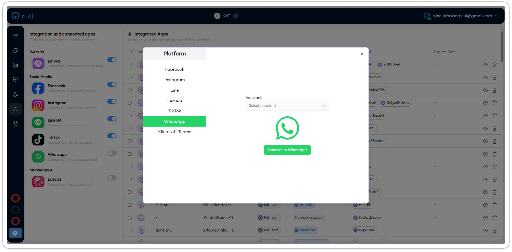

2. เลือก Assistant หรือหมาผู้ช่วย แล้วทำการกดปุ่ม **"Connect to WhatsApp"** 🐶

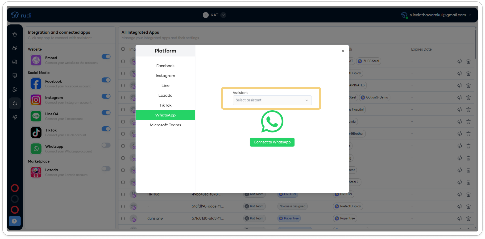

3. ทำการเลือก Facebook Business ที่ต้องการให้ OrcaSync เข้าถึง หรือเลือกตามภาพคือให้เข้าถึงทั้งหมด 🏢

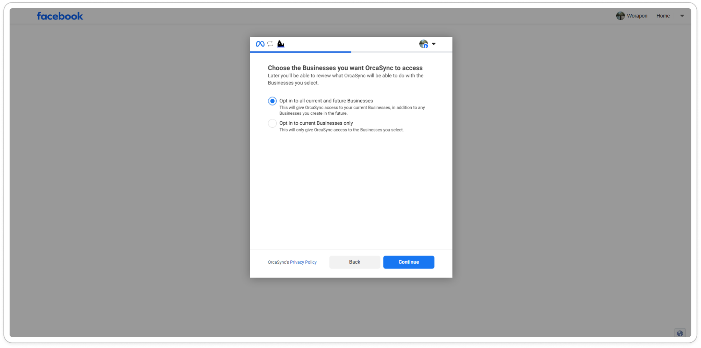

4. ทำการเลือก WhatsApp Account ที่ต้องการให้ OrcaSync เข้าถึง หรือเลือกตามภาพคือให้เข้าถึงทั้งหมด ✅

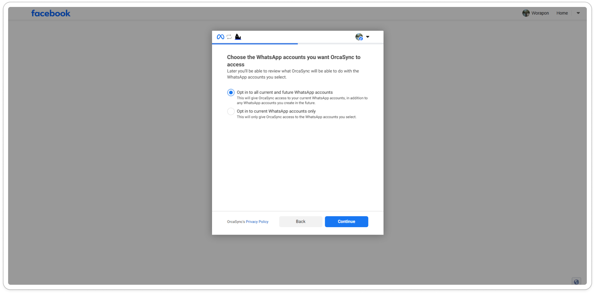

5. กด **Save** 💾

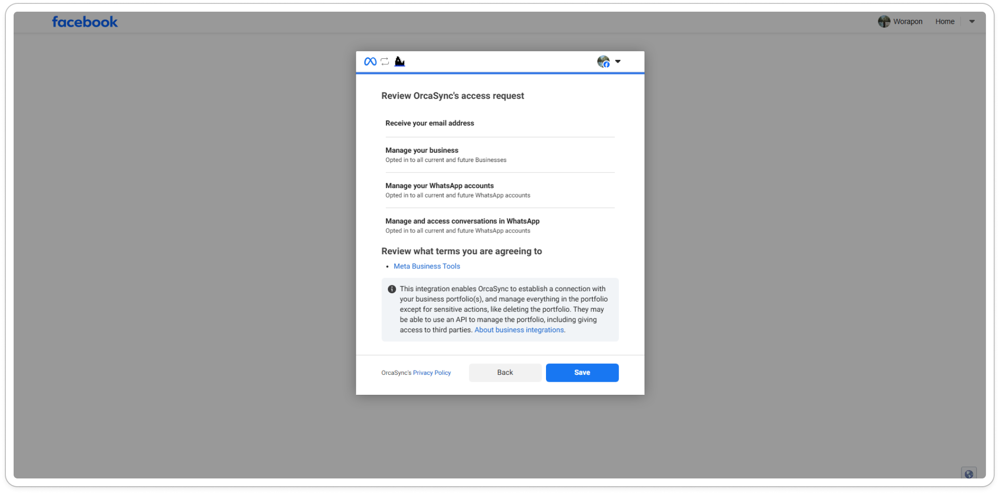

6. กด **Got it** 👌

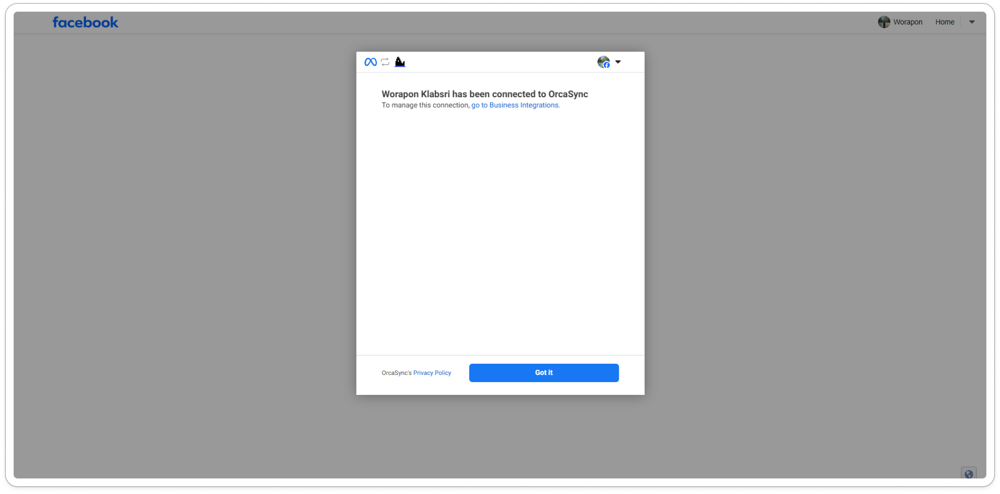

7. กด **Login with Facebook** 🔐

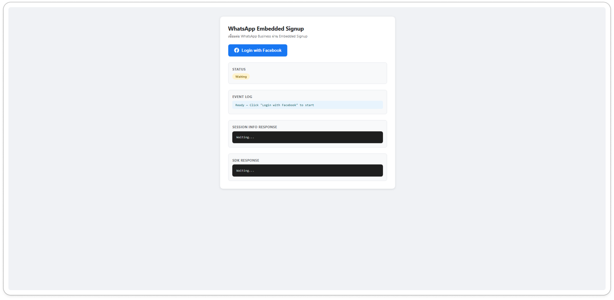

8. กด **Continue** ➡️

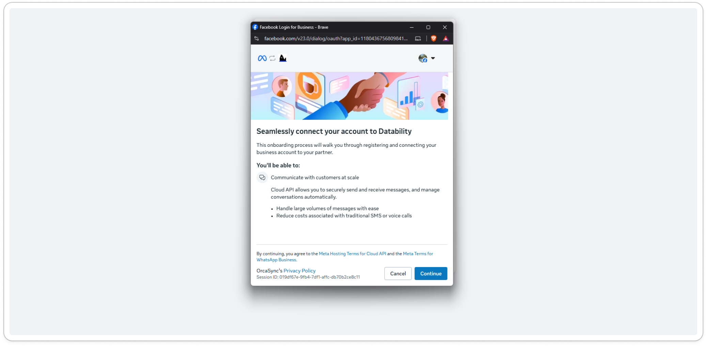

9. ทำการเลือก Facebook Business Portfolio หากไม่มีเลยก็เลือกตามภาพ = สร้างใหม่หมด 🆕

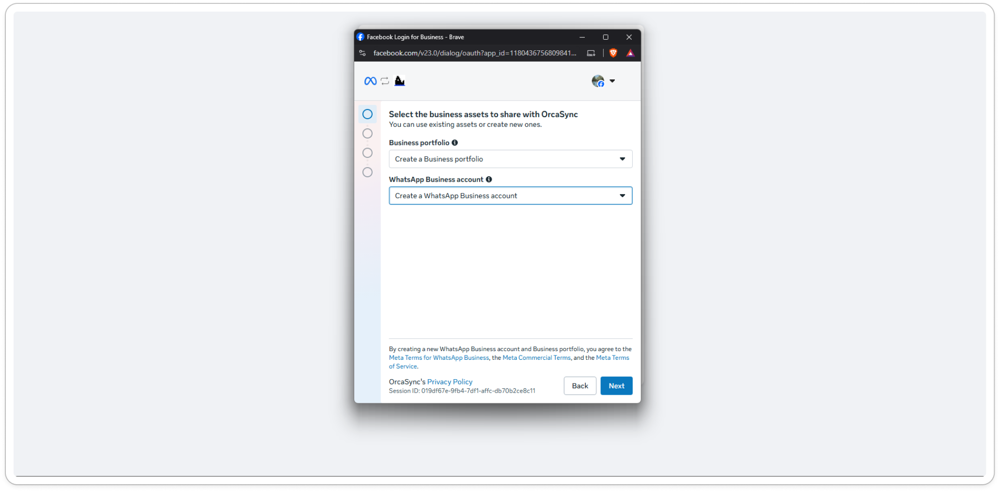

10. ใส่ข้อมูลที่จำเป็นสำหรับการสร้าง Facebook Business Portfolio 📝

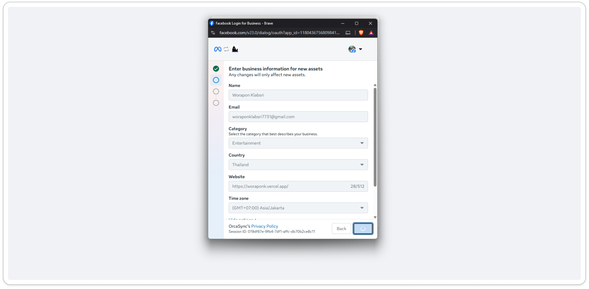

11. กรอกข้อมูลสำคัญดังนี้:
    - **[1]** ใส่ข้อมูลเบอร์โทร 📌 **สำคัญมาก** ตามข้อควรรู้ข้างต้น
    - **[2]** ใส่ชื่อให้กับ WhatsApp นี้ 📌 **สำคัญมาก** ต้องตาม pattern ข้างบน แล้วเลือกเป็น **Text Message** เพื่อส่ง OTP มา 📩

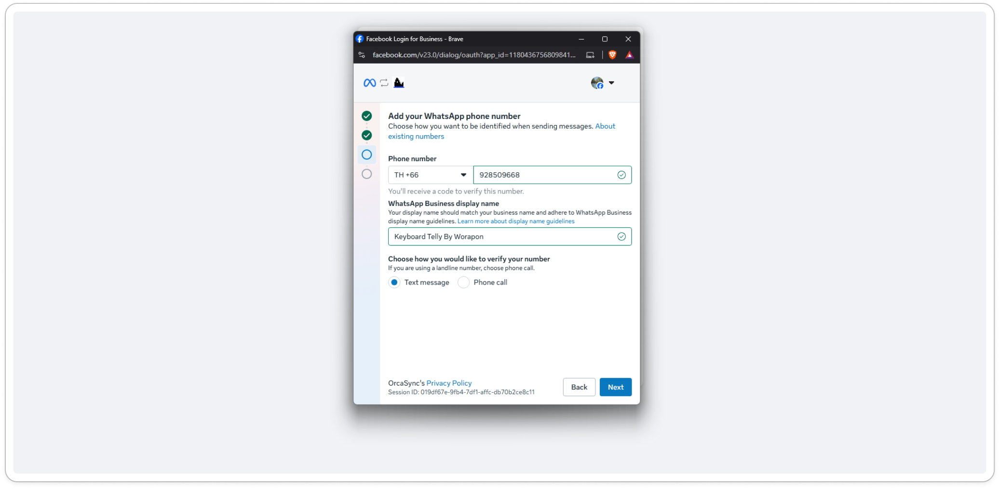

12. ตรวจสอบ OTP ที่จะส่งมาตามเบอร์ที่ใส่ไปในขั้นตอนที่ 11 🔢

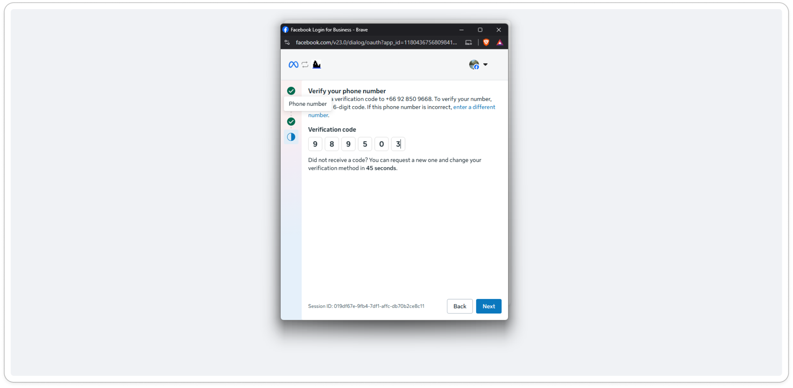

13. ตรวจสอบข้อมูลของ WhatsApp ที่จะให้ OrcaSync หรือ Rudi ทำการเชื่อมต่อ 🔍

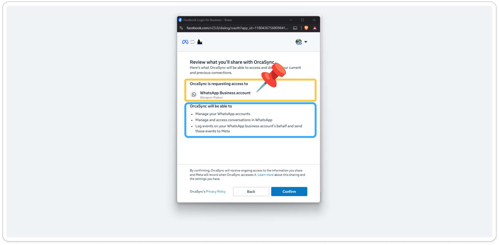

14. รอทาง Facebook ประมวลผลข้อมูลสักครู่ ⏳

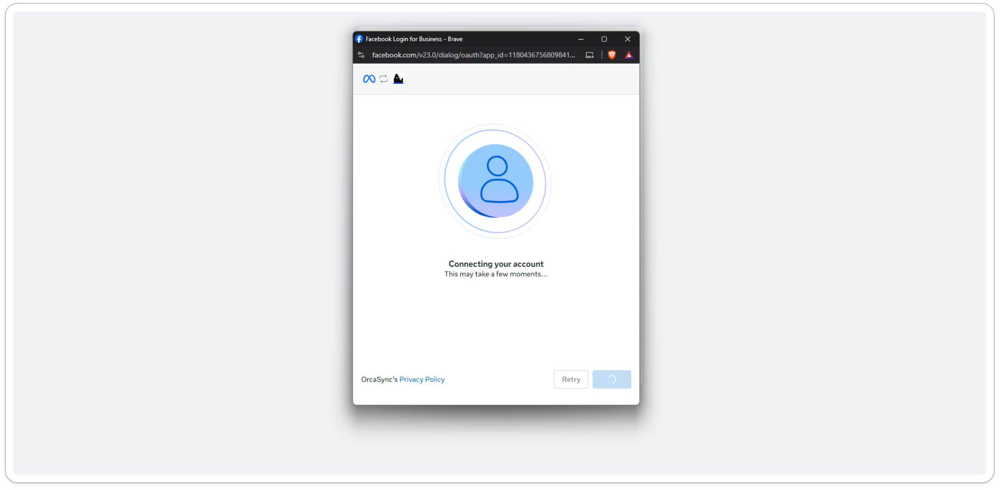

15. หากขึ้นตามภาพ แสดงว่าทุกอย่างเป็นไปด้วยดี กดปุ่ม **Finish** ได้เลย 🎉

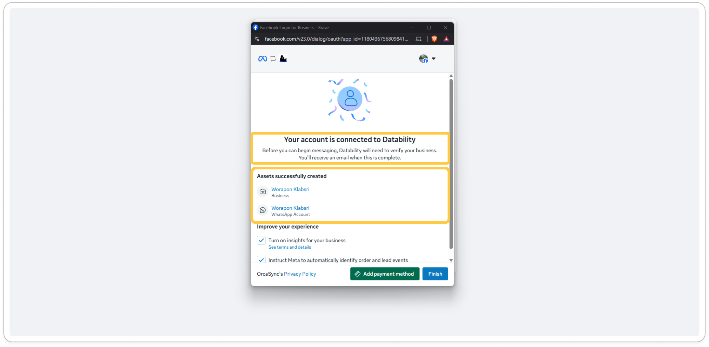

16. หลังจากนั้นจะกลับมาที่ระบบ Rudi แล้วจะเห็นรายการของ WhatsApp ขึ้นเชื่อมต่อได้แล้ว 👍

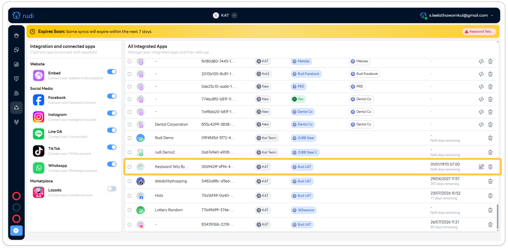

17. เข้าในเว็บของ Facebook Business แล้วเลือก Business Portfolio ที่ได้สร้างไปในขั้นตอนก่อนหน้า 🌐

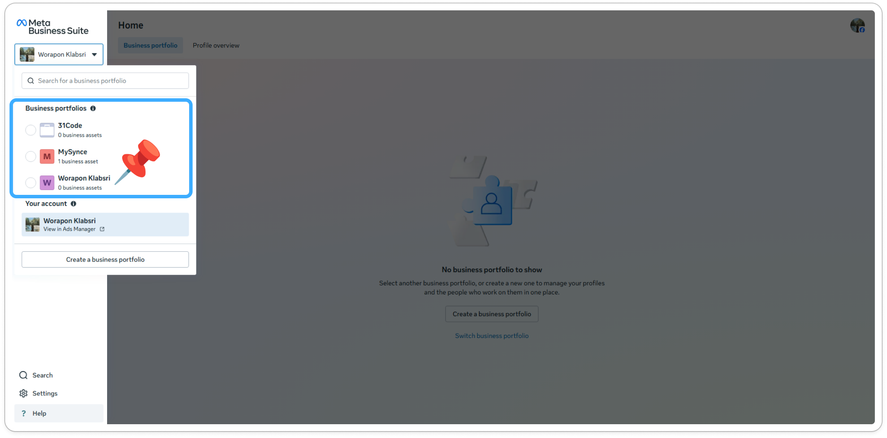

18. เลือกเสร็จแล้ว ระบบของ Facebook ก็จะพามาแสดงตามภาพ กด **Setting** ได้เลย ⚙️

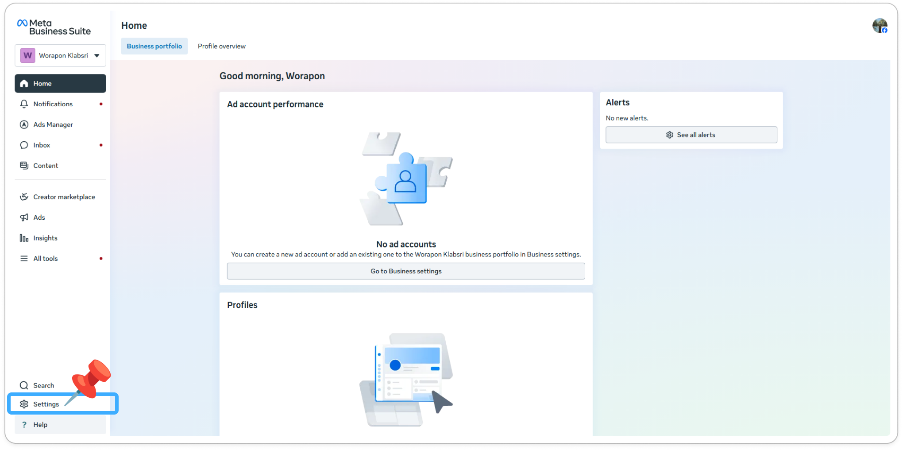

19. เลือกเมนู **WhatsApp accounts** แล้วจะเห็นสิ่งที่สร้างไปในขั้นตอนก่อนหน้าในหน้านี้เลย 📋

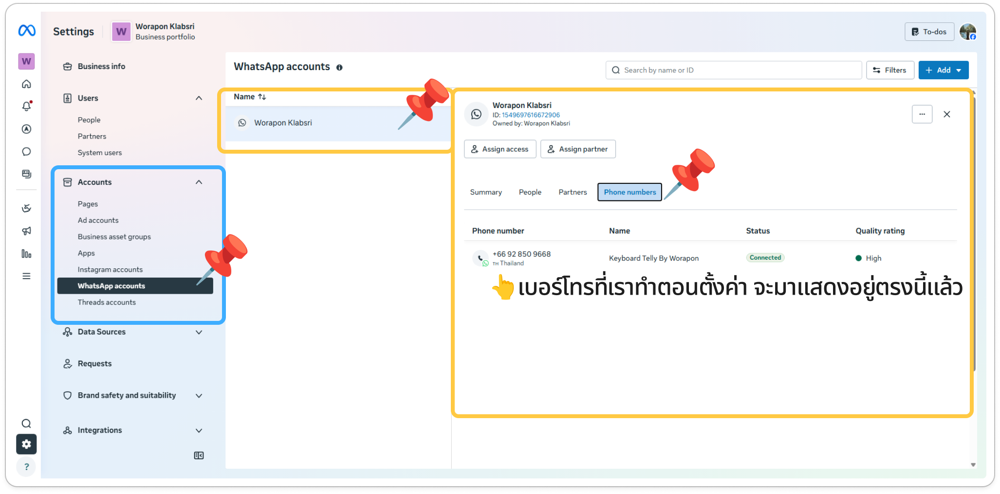

:::success
หากขั้นตอนถูกต้องทั้งหมด ระบบจะแสดงผลการเชื่อมต่อกับ WhatsApp เรียบร้อย พร้อมใช้งาน Rudi ได้ทันที 🎊
:::
