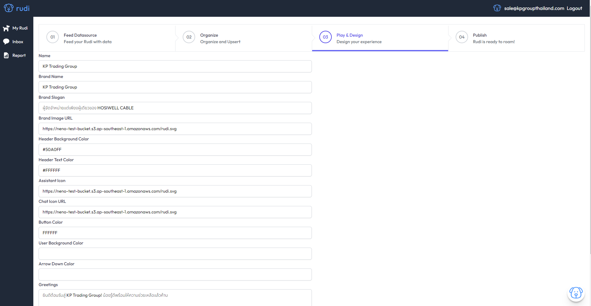
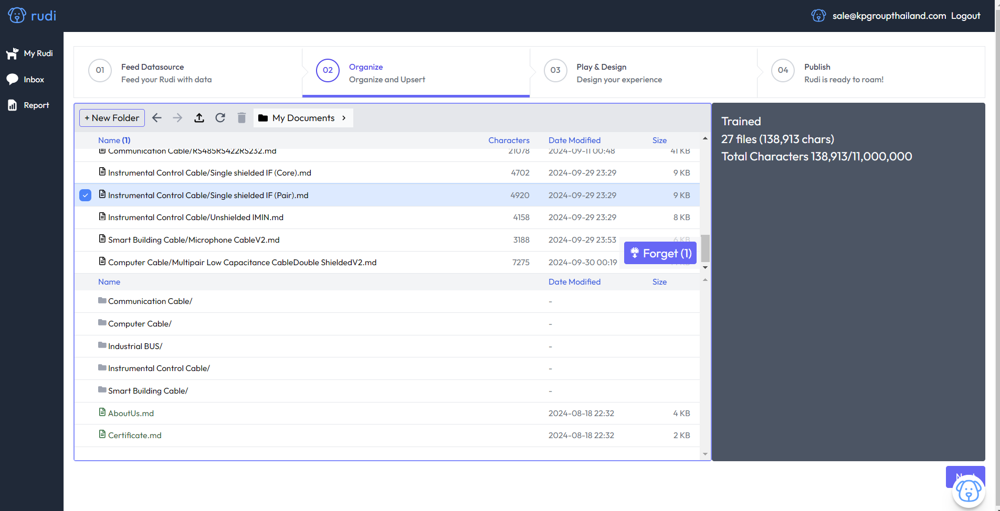
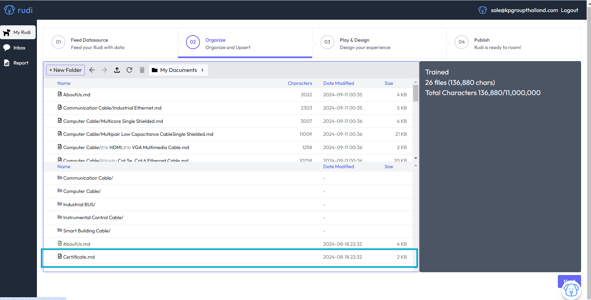

# Update & Cancel Data ♨️

## Update new Data

### Step 1. ป้อนข้อมูลให้ Rudi (Import Data)

#### คลิก "Feed Datasource"

- ถ้าต้องการจัดกลุ่มข้อมูล คลิกสร้าง Floder
- ตั้งชื่อ Floder (ถ้ามมี)
  
- ลากไฟล์ข้อมูลลงใน ระบบ หรือ Floder ที่ส้ราง
  

- กดปุ่ม Next สำหรับต้องการ Train ข้อมูล

### Step 2. การฝึกน้อง Rudi (Train Rudi)

#### คลิก "Organize and Upsert"

- คลิกเลือกไฟล์ที่ต้องการ Train
- กดปุ่ม train
  

:::tip["Success"]

ฝึกสำเร็จ

:::

:::danger["Error"]

ฝึกข้อมูลไม่ผ่าน

:::

- ขวามือ แสดงจำนวนไฟล์ทั้งหมดและจำนวนตัวอักษณที่ถูก Train

### Step 3. ขั้นตอนการ Design Chatbot

#### คลิก Play & Design

- Setup ChatUI ตามที่หัวข้อระบุ
- Greetings = คำทักทายก่อนเริ่มบทสนทนา
- กดปุ่ม "Save"

:::info[แนะนำการเปลี่ยนข้อมูล]

ถ้าต้องการเปลี่ยนข้อมูล แนะนำเปลี่ยนเฉพาะ "Greetings" แต่ต้องทำการอัพเดต Code ด้วยเช่นกัน
:::

## ยกเลิกข้อมูลที่ Train

### กดเลือก Step 2. การฝึกน้อง Rudi (Train Rudi)

#### คลิก"Organize and Upsert"

- คลิกเลือกไฟล์ที่ต้อง "ยกเลิก" การ Train ข้อมูล
- คลิก "Forget"
  

:::tip["Success"]

สำเร็จไฟล์นั้น จะเป็นสีดำ

:::

