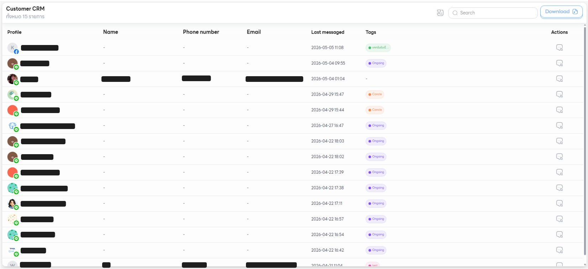
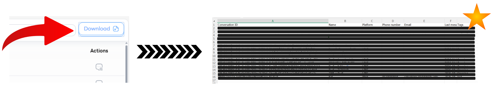
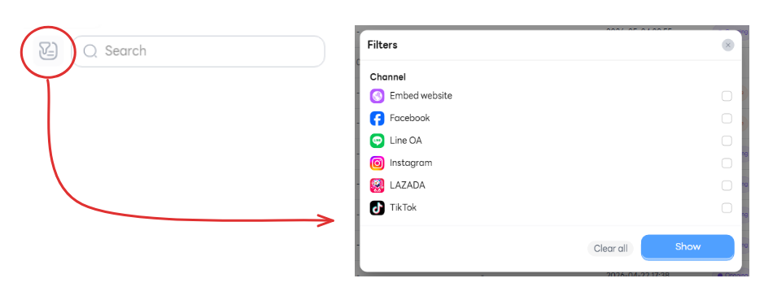

# Customer CRM 👥

หน้า **Customer CRM** เป็นศูนย์รวมข้อมูลลูกค้าทั้งหมดที่เคยติดต่อเข้ามาผ่านทุกช่องทาง ช่วยให้ทีมจัดการข้อมูลลูกค้า ติดตามประวัติการสนทนา และนำข้อมูลไปใช้ต่อยอดทางการตลาดได้สะดวก 🚀

---

## 1. Customer List 📋

รายการลูกค้าทั้งหมดในระบบ แสดงข้อมูลพื้นฐาน เช่น ชื่อ ช่องทางที่ติดต่อมา แท็ก และสถานะล่าสุด สามารถคลิกเข้าไปดูรายละเอียดการสนทนากับลูกค้าแต่ละรายได้ 👀

---

## 2. Download CRM as Excel 📥

ดาวน์โหลดข้อมูลลูกค้าทั้งหมด (หรือเฉพาะที่กรองไว้) ออกมาเป็นไฟล์ **Excel** เพื่อนำไปใช้วิเคราะห์ต่อ ทำรายงาน หรือส่งต่อให้ทีมการตลาด/ทีมขาย 📊

---

## 3. Search & Filters 🔍

เครื่องมือค้นหาและกรองข้อมูลลูกค้า เช่น ค้นหาด้วยชื่อ เบอร์โทร แท็ก หรือกรองตามช่องทาง/ช่วงเวลา ช่วยให้หาลูกค้ากลุ่มเป้าหมายได้รวดเร็วเมื่อมีข้อมูลจำนวนมาก ⚡

