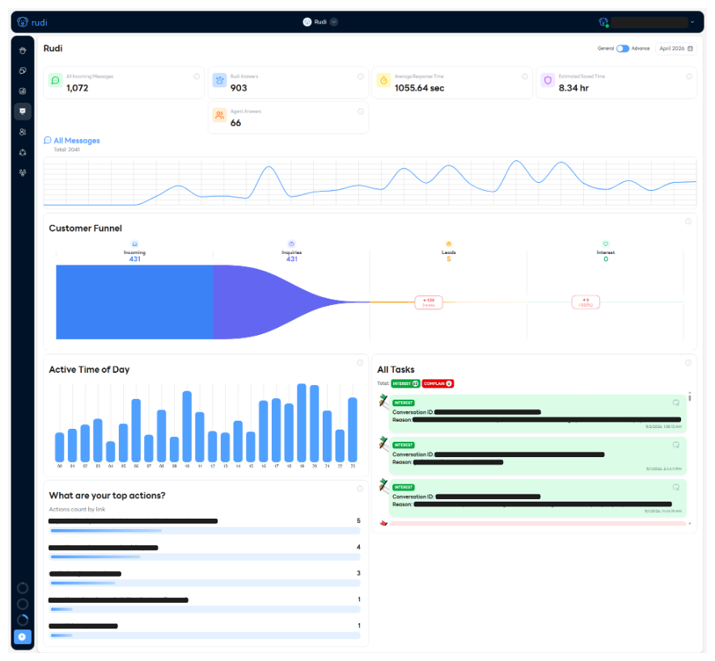
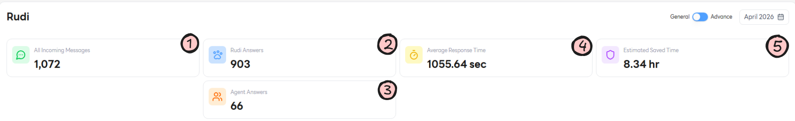
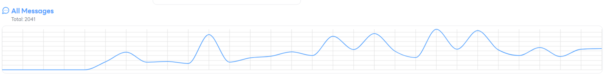
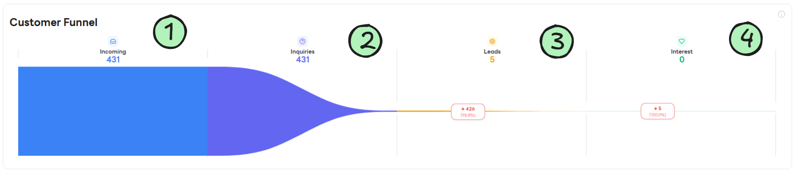
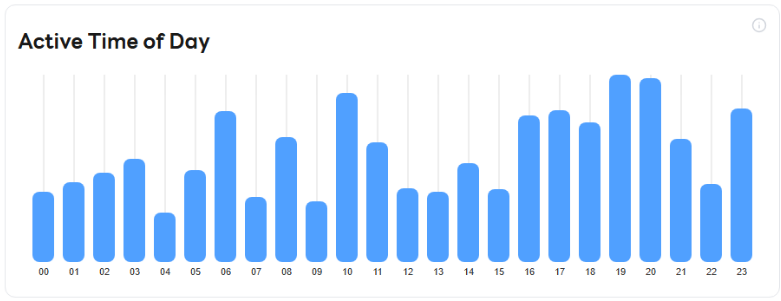
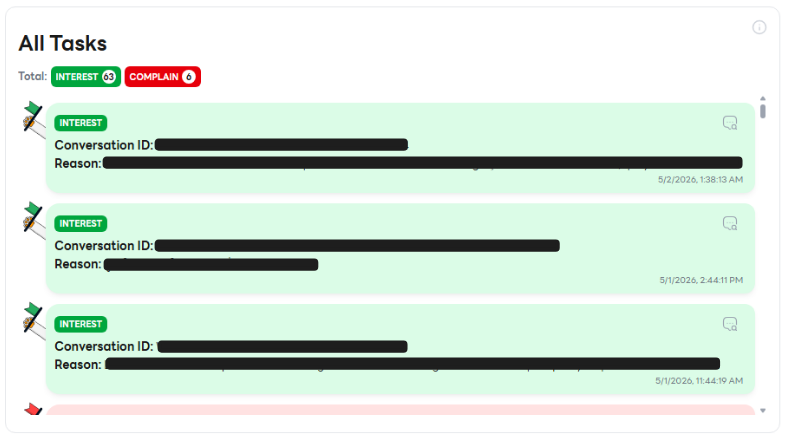
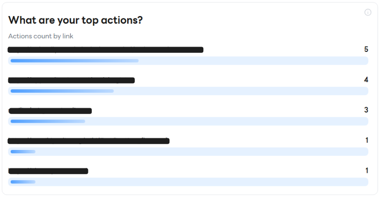

# Dashboard 📊

หน้า **Dashboard** เป็นภาพรวมสถิติการทำงานของ Rudi และทีม ช่วยให้ผู้ใช้งานติดตามผลการตอบแชท ปริมาณข้อความ และพฤติกรรมของลูกค้าได้ในที่เดียว 🔍

---

## 1. Dashboard Metrics 📈

ตัวชี้วัดหลักที่แสดงภาพรวมประสิทธิภาพการตอบแชทในช่วงเวลาที่เลือก

### 1.1 All Incoming Messages 📥

จำนวนข้อความทั้งหมดที่ลูกค้าส่งเข้ามาผ่านทุกช่องทางที่เชื่อมต่อกับ Rudi

### 1.2 Rudi Answers 🤖

จำนวนข้อความที่ Rudi (AI) เป็นผู้ตอบโดยอัตโนมัติ ใช้ดูสัดส่วนงานที่ AI ช่วยแบ่งเบาจากทีม

### 1.3 Agent Answers 🧑‍💼

จำนวนข้อความที่ตอบโดยเจ้าหน้าที่ (Agent) ใช้ประเมินภาระงานของทีมแอดมิน

### 1.4 Average Response Time ⏱️

ระยะเวลาเฉลี่ยตั้งแต่ลูกค้าส่งข้อความเข้ามาจนได้รับการตอบกลับครั้งแรก

### 1.5 Estimated Saved Time ⏳

เวลาที่ประหยัดได้โดยประมาณจากการให้ Rudi ช่วยตอบแทนเจ้าหน้าที่

---

## 2. All Messages 💬

กราฟแสดงปริมาณข้อความทั้งหมดในแต่ละช่วงเวลา ช่วยให้เห็นแนวโน้มการเข้ามาของลูกค้าและช่วงที่มีปริมาณงานสูง 📅

---

## 3. Customer Funnel 🛒

ภาพรวมการเดินทางของลูกค้า (Customer Journey) ตั้งแต่ทักเข้ามาจนแสดงความสนใจสินค้า/บริการ

### 3.1 Incoming 👋

จำนวนลูกค้าที่ทักเข้ามาทั้งหมด เป็นจุดเริ่มต้นของ Funnel

### 3.2 Inquiries ❓

จำนวนลูกค้าที่มีการสอบถามข้อมูลเพิ่มเติมเกี่ยวกับสินค้าหรือบริการ

### 3.3 Leads 🎯

จำนวนลูกค้าที่มีศักยภาพ (Potential Customer) แสดงท่าทีสนใจชัดเจน เช่น ขอราคา ขอรายละเอียดสินค้า

### 3.4 Interest 💖

จำนวนลูกค้าที่แสดงความสนใจในระดับสูง พร้อมเข้าสู่ขั้นตอนการตัดสินใจซื้อ

---

## 4. Active Time of Day 🕒

แสดงช่วงเวลาที่ลูกค้าทักเข้ามามากที่สุดในแต่ละวัน ใช้วางแผนจัดเวรแอดมินหรือเตรียมแคมเปญให้ตรงกับช่วงที่ลูกค้า active 🔥

---

## 5. All Tasks ✅

รายการงานที่น้อง **Rudi** ต้องการความช่วยเหลือจากเจ้าหน้าที่ทั้งหมด เช่น ลูกค้าสนใจ, ลูกค้ารายงาน และกรณีที่ไม่สามารถตอบลูกค้าได้

---

## 6. What are your top actions? 🏆

สรุป Action ยอดนิยมที่เกิดขึ้นในระบบ ช่วยให้เข้าใจว่าลูกค้ามีพฤติกรรมหรือความต้องการแบบใดมากที่สุด เพื่อนำไปปรับปรุงการตอบและการให้บริการ ✨

