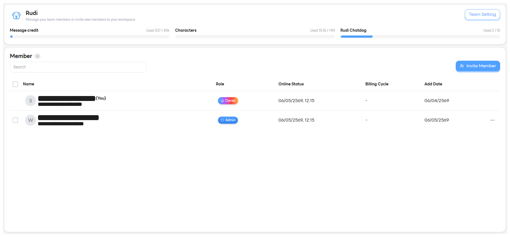
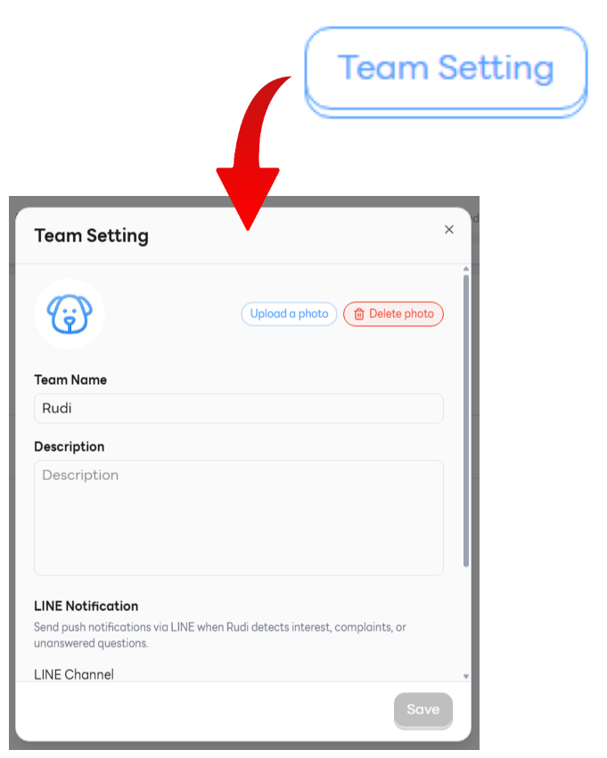
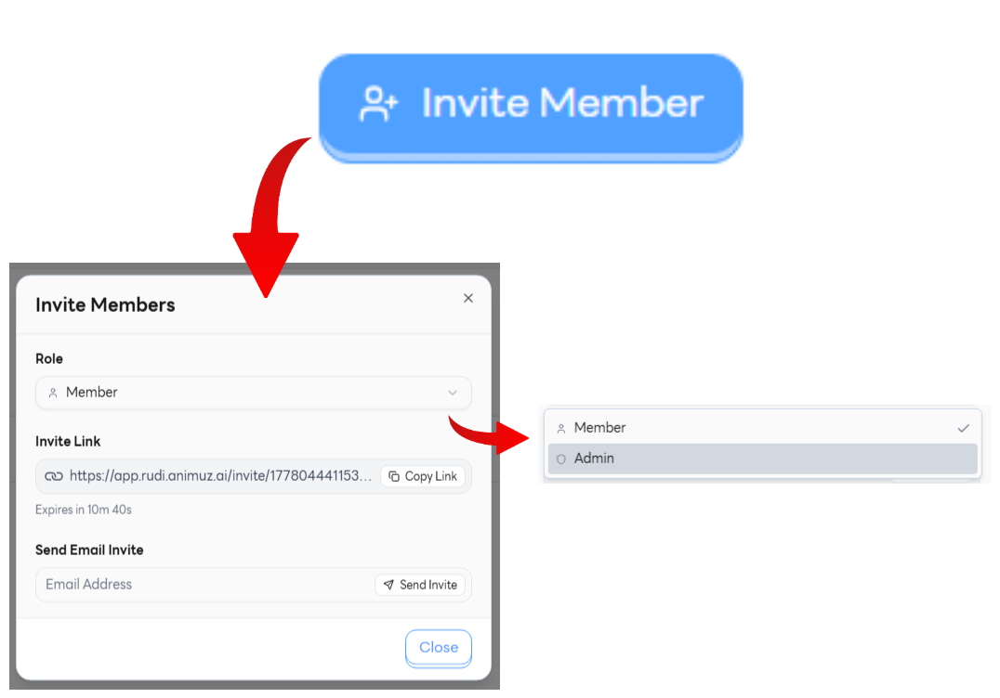
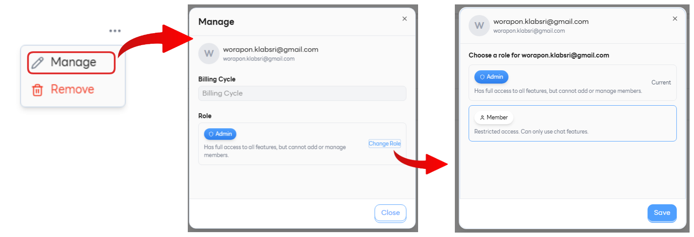
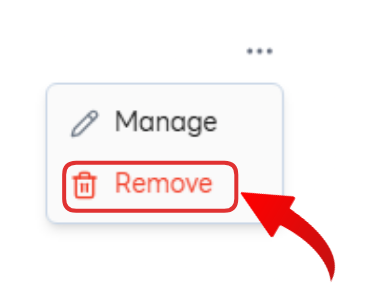

# Team Settings ⚙️

หน้า **Team Settings** ใช้สำหรับตั้งค่าข้อมูลทีม เชิญสมาชิกเข้าร่วม และจัดการสิทธิ์ของสมาชิกแต่ละคนภายในทีม 👥

---

## 1. Setting 🛠️

ตั้งค่าข้อมูลพื้นฐานของทีมที่จะแสดงให้สมาชิกทุกคนเห็น

- **Upload profile** 🖼️ — อัปโหลดรูปโปรไฟล์ของทีม เพื่อให้ทีมมีเอกลักษณ์และจดจำง่าย
- **Team Name** 🏷️ — ชื่อทีมที่ใช้แสดงในระบบและการแจ้งเตือน
- **Description** 📝 — คำอธิบายสั้น ๆ เกี่ยวกับทีม เช่น หน้าที่ ขอบเขตงาน หรือวัตถุประสงค์

---

## 2. Invite Member 📨

ช่องทางการเชิญสมาชิกใหม่เข้ามาในทีม รองรับการเชิญหลายรูปแบบเพื่อความยืดหยุ่น

- **Role** 🎭 — เลือกบทบาทของสมาชิกที่จะเชิญ
  - **Member** 👤 — สมาชิกทั่วไป ใช้งานระบบได้ตามสิทธิ์ที่กำหนด
  - **Admin** 🛡️ — ผู้ดูแล มีสิทธิ์จัดการทีมและสมาชิกทั้งหมด
- **Invite Link → Generate Link** 🔗 — สร้างลิงก์เชิญที่สามารถส่งต่อให้ผู้ที่ต้องการเข้าร่วมทีมได้ทันที
- **Send Email Invite** ✉️ — ส่งคำเชิญผ่านอีเมลโดยตรงไปยังบุคคลที่ต้องการเชิญเข้าทีม

---

## 3. Manage Member 👥

จัดการสมาชิกที่อยู่ในทีมปัจจุบัน ตรวจสอบสถานะ และปรับสิทธิ์ได้ตามต้องการ

- **Show details** 🔍 — แสดงรายละเอียดของสมาชิกแต่ละคน ได้แก่
  - **Name** 🪪 — ชื่อสมาชิก
  - **Role** 🎭 — บทบาทในทีม (Member / Admin)
  - **Online Status** 🟢 — สถานะการออนไลน์ในขณะนั้น
  - **Billing Cycle** 💳 — รอบบิลที่ผูกกับสมาชิกคนนั้น
  - **Add Date** 📅 — วันที่เข้าร่วมทีม
- **Change Role** 🔄 — เปลี่ยนบทบาทของสมาชิก เช่น เลื่อนจาก Member เป็น Admin หรือกลับกัน

  

- **Remove** ❌ — ลบสมาชิกออกจากทีม เมื่อไม่ต้องการให้เข้าถึงข้อมูลทีมอีกต่อไป

  
