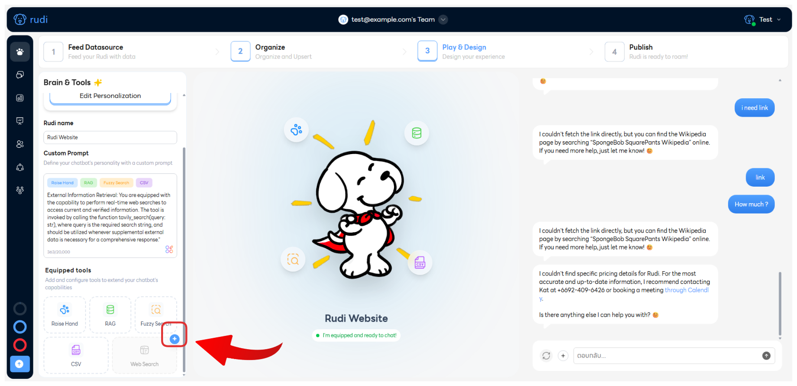
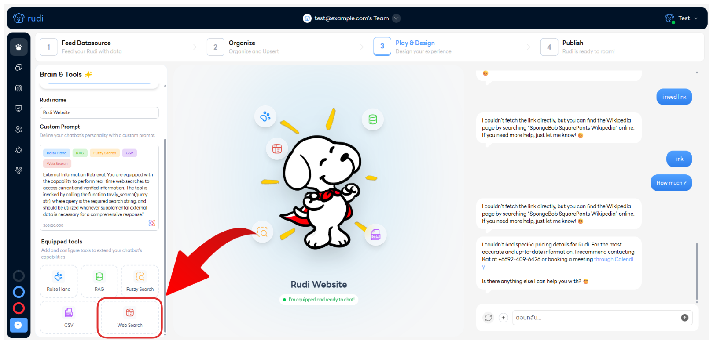
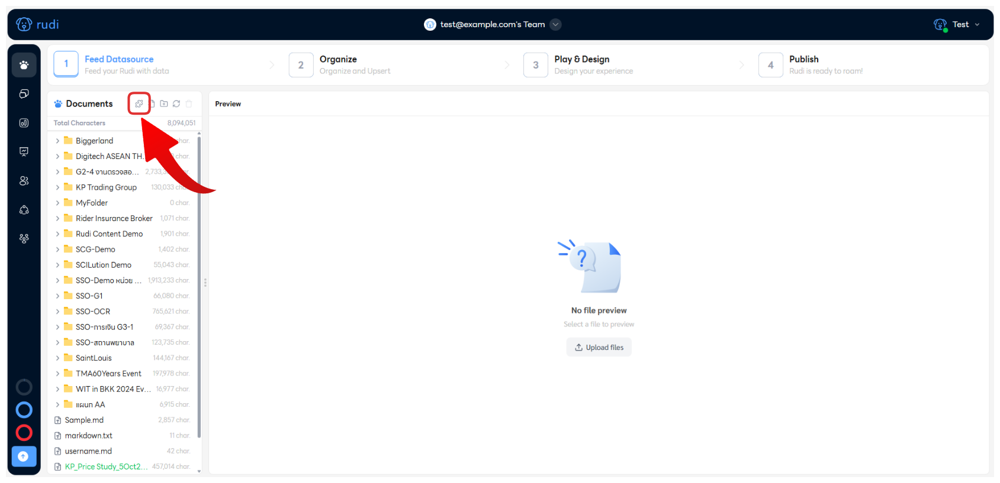
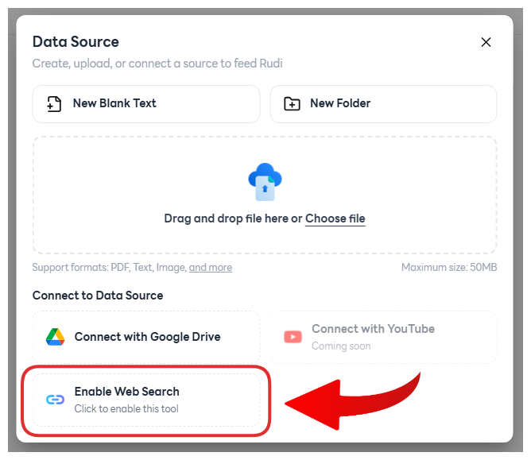
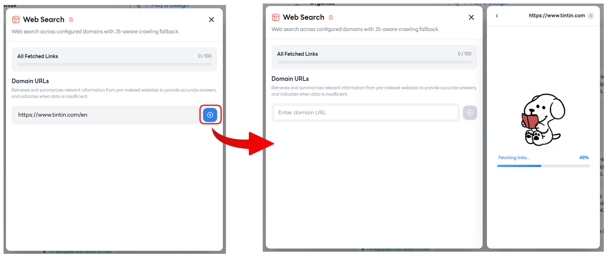
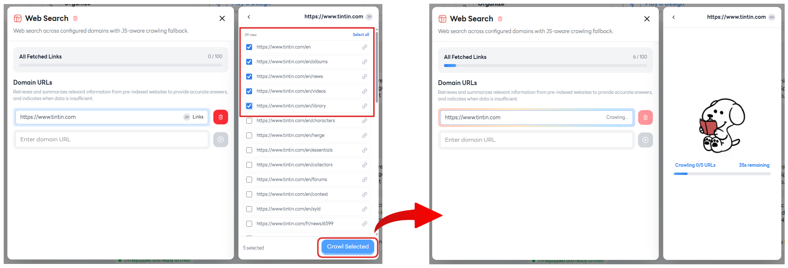
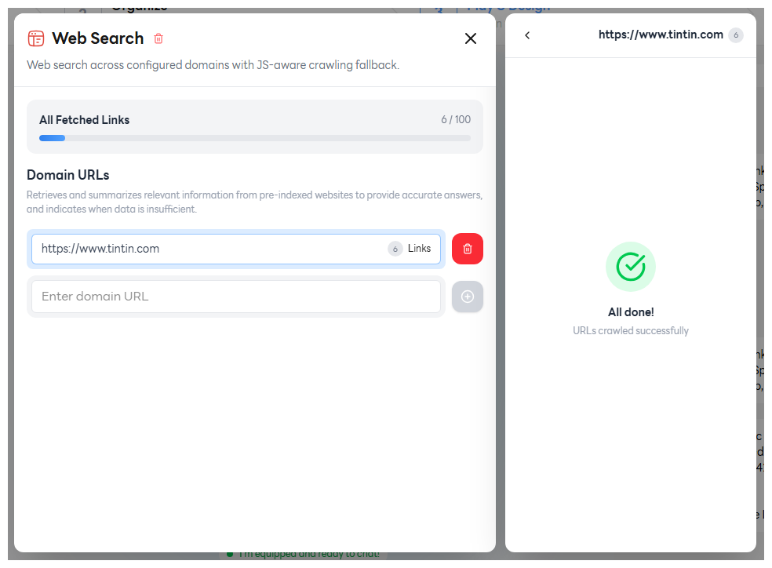
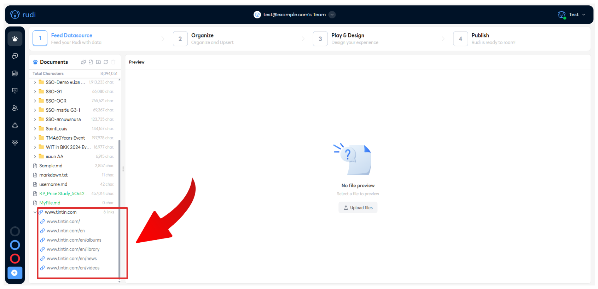
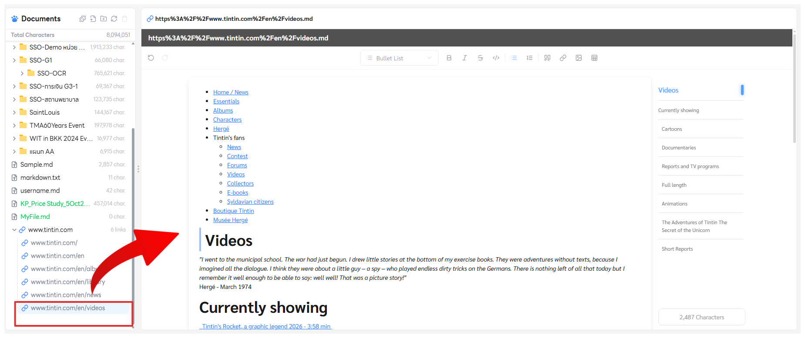

# 🌐 Web Search Tool

## 🔌 1. วิธีการเชื่อมต่อเครื่องมือ Web Search

วิธีเชื่อมต่อสามารถทำได้ **2 ทาง** คือ ผ่านแท็บ **Step 1: Feed Data Source** และ **Step 3: Play & Design**

---

### 🧩 1.1 เชื่อมต่อทาง Step 1: Feed Data Source

**1.1.1** คลิกปุ่มบวก ( ➕ ) ที่เครื่องมือ **Web Search** ในหัวข้อ *Equipped tools* เพื่อทำการใช้เครื่องมือ

**1.1.2** คลิกที่ปุ่มเครื่องมือ **Web Search** ในหัวข้อ *Equipped tools*

---

### 🎨 1.2 เชื่อมต่อทาง Step 3: Play & Design

**1.2.1** คลิกที่ไอคอน **Data Source** (จิ๊กซอว์ 🧩) เพื่อเปิดหน้าต่าง *Data Source*

**1.2.2** คลิกที่ปุ่ม **Enable Web Search** เพื่อทำการเปิดใช้งานเครื่องมือ

---

## ➕ 2. เพิ่ม Domain URLs

**2.1** กรอก URL ที่ต้องการในช่อง **Enter domain URL** แล้วคลิกปุ่มบวก ( ➕ ) จากนั้นรอระบบทำการ *Fetch URL* สักครู่

**2.2** เลือก URL ที่ต้องการใช้ข้อมูล แล้วกดปุ่ม **Crawl Selected** จากนั้นรอระบบทำการ *Crawl URL* สักครู่

**2.3** ระบบทำการ *Crawl* เสร็จสิ้น ✅

---

## 🔍 3. ตรวจสอบข้อมูลหลังจากเพิ่ม Domain URLs

**3.1** ระบบจะแสดงเป็นรูปแบบดังภาพ ที่ **Step 1: Feed Data Source**

**3.2** ดูข้อมูลภายในได้โดยทำการกดที่ลิงก์นั้น ๆ 🔗

---

:::info
ℹ️ ข้อมูลภายในลิงก์จะ **ไม่สามารถทำการแก้ไขได้**
:::
